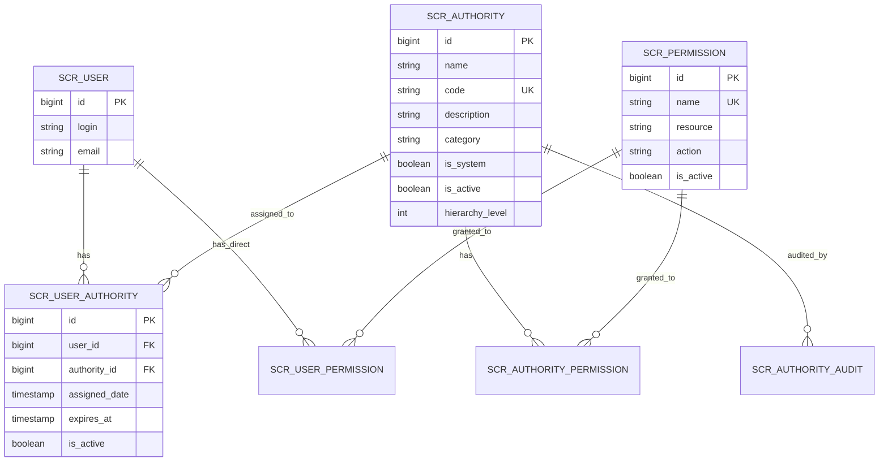
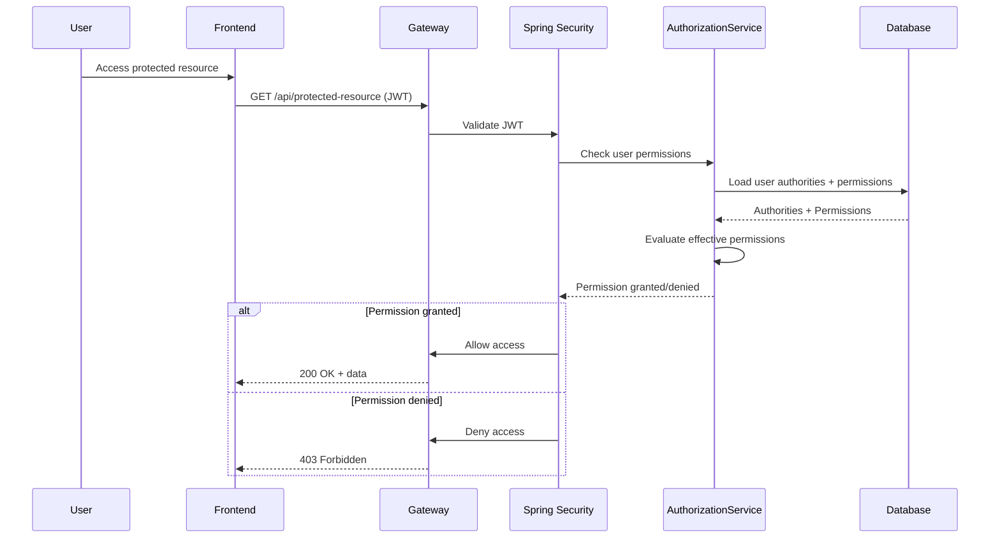
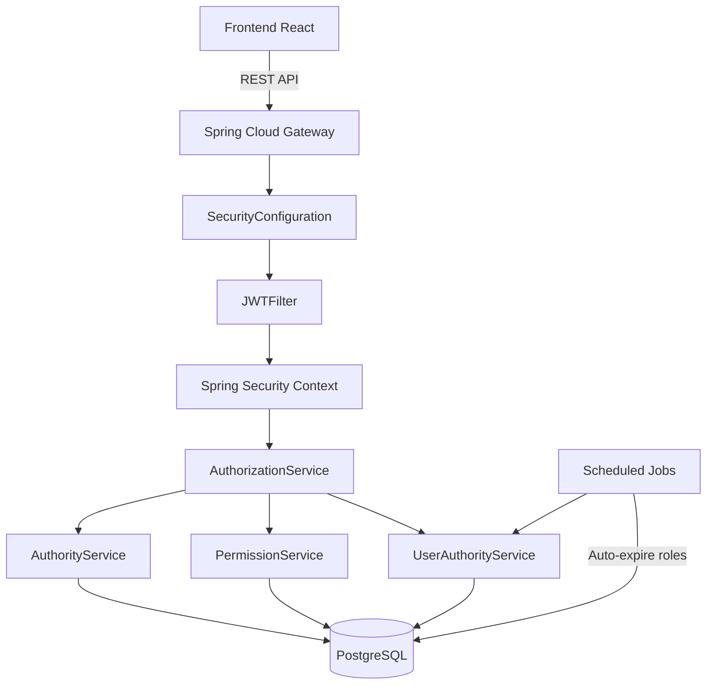

# Plan C - Sistema de Autorización Enterprise

# Fases 9-12

**Fecha de creación:** 2025-10-31
**Última actualización:** 2025-11-07
**Estado:** Fases 0-9 completadas | Fase 10 en progreso (78%) | Fases 11-12 pendientes
**Rama:** `feature/enterprise-authorization-system`

---

## 🎯 Progreso Actual

### ✅ Fase 9: COMPLETADA (2025-11-02)

**Commits:** 1 commit | **Archivos:** 8 nuevos | **Líneas:** 1,623

- ✅ AuthorityAuditService con consultas avanzadas
- ✅ AuditExportService (CSV/JSON)
- ✅ AuthorityAuditResource con 9 endpoints REST
- ✅ 13 tests de integración pasando
- ✅ Métricas de auditoría y exportación funcional

### 🔄 Fase 10: EN PROGRESO (78% completado)

**Commits:** 3+ commits | **Archivos:** 30+ nuevos | **Líneas:** ~2,500+

- ✅ **Paso 10.1:** Modelos TypeScript (8 archivos)
- ✅ **Paso 10.2:** Servicios API (4 archivos, 34 métodos)
- ✅ **Paso 10.3:** Redux slices (3 reducers, 21 async thunks)
- ✅ **Paso 10.4:** Componentes UI - Authority Management (5 componentes)
  - authority-list.tsx (lista con badges y acciones)
  - authority-detail.tsx (detalle con permisos)
  - authority-form.tsx (crear/editar con validaciones)
  - authority-delete-dialog.tsx (confirmación)
  - index.tsx (rutas anidadas)
- ✅ **Paso 10.5:** Componentes UI - Permission Management (5 componentes)
  - permission-list.tsx (lista con filtros y búsqueda)
  - permission-detail.tsx (detalle)
  - permission-form.tsx (formulario con auto-generación de nombre)
  - permission-delete-dialog.tsx (confirmación)
  - index.tsx (rutas anidadas)
- ⏳ **Paso 10.6:** Componentes UI - User Authority Assignment (pendiente)
- ✅ **Paso 10.7:** Rutas y navegación
  - Rutas integradas en /admin/administration/index.tsx
  - Menú actualizado en admin.tsx con iconos shield-alt y key
- ✅ **Paso 10.8:** Internacionalización (i18n)
  - authorization.json (ES) - 100+ keys
  - authorization.json (EN) - 100+ keys
- ⏳ **Paso 10.9:** Tests de UI (pendiente)

---

## 📊 Resumen Ejecutivo

### ✅ Completado (Fases 0-9)

El sistema de autorización enterprise backend + auditoría está **100% completo** con:

**Backend Core (Fases 0-8):**

- ✅ **Fase 0:** Preparación y configuración (prefijo `scr_`, restructuración de tablas)
- ✅ **Fase 1:** Base de datos (6 tablas nuevas con Liquibase)
- ✅ **Fase 2:** Entidades Java (Authority, Permission, UserAuthority, UserPermission, AuthorityPermission, AuthorityAudit)
- ✅ **Fase 3:** Repositorios R2DBC reactivos con queries custom
- ✅ **Fase 4:** DTOs y Mappers (implícito en servicios)
- ✅ **Fase 5:** Servicios de negocio (AuthorityService, PermissionService, UserAuthorityService, etc.)
- ✅ **Fase 6:** REST Controllers (AuthorityResource, PermissionResource, UserAuthorityResource, UserPermissionResource, AuthorityPermissionResource)
- ✅ **Fase 7:** Integración Spring Security (SecurityConfiguration, JWTFilter actualizado)
- ✅ **Fase 8:** Testing completo (54 tests de integración pasando)

**Auditoría Avanzada (Fase 9):**

- ✅ **Fase 9:** Endpoints de auditoría con exportación CSV/JSON, búsqueda avanzada y métricas

**Estado del sistema:**

- 6 tablas con prefijo `scr_*`
- 67 tests de integración pasando (54 base + 13 auditoría)
- Seed data cargado (2 roles, 13 permisos, 16 asignaciones)
- API REST completa con 9 endpoints de auditoría
- Spring Security integrado
- Exportación de logs a CSV/JSON funcional

**Frontend Avanzado (Fase 10 - 78%):**

- ✅ 8 modelos TypeScript con interfaces completas
- ✅ 4 servicios API (34 métodos HTTP)
- ✅ 3 Redux slices (21 async thunks)
- ✅ 10 componentes UI (Authority + Permission CRUD completo)
- ✅ Rutas y navegación integradas
- ✅ i18n completo (ES + EN)
- ⏳ User Authority Assignment (pendiente)
- ⏳ Tests de UI (pendiente)

---

## ⏳ Pendiente (Fases 10-12)

### Fase 10: Frontend React para Gestión de Permisos (22% pendiente)

**Completado (78%):**

- ✅ Modelos TypeScript (`IAuthority`, `IPermission`, etc.) - 8 archivos
- ✅ Servicios API con axios (34 métodos) - 4 archivos
- ✅ Redux slices para gestión de estado (3 reducers) - 21 async thunks
- ✅ **NUEVO:** Componentes UI Authority Management - 5 componentes
  - Lista, detalle, formulario, delete dialog, routes
- ✅ **NUEVO:** Componentes UI Permission Management - 5 componentes
  - Lista con filtros, detalle, formulario con auto-gen, delete dialog, routes
- ✅ **NUEVO:** Rutas y navegación completas
  - Integración en /admin/administration
  - Menú admin actualizado con iconos
- ✅ **NUEVO:** Internacionalización completa (ES/EN)
  - authorization.json con 100+ claves de traducción

**Pendiente (22%):**

- ⏳ Componentes UI - User Authority Assignment (asignar/revocar roles a usuarios)
- ⏳ Tests de UI con Jest (authority-list.spec.tsx, etc.)

### Fase 11: Dashboard de Administración Avanzado

- Panel de control con métricas en tiempo real
- Visualización de permisos activos por usuario
- Alertas de roles próximos a expirar
- Gráficos y estadísticas de uso (Recharts)
- Integración con dashboard existente

### Fase 12: Documentación de Usuario Final

- Manual de usuario (administradores y usuarios finales)
- Guías de operación (cómo asignar roles, permisos, etc.)
- Documentación de API (Swagger enriquecido)
- Diagramas actualizados (ER, flujo de autorización)
- FAQ y troubleshooting

---

## 🗺️ FASE 9: Endpoints de Auditoría Avanzados ✅ COMPLETADA

**Objetivo:** Crear endpoints REST completos para consultar, filtrar y exportar logs de auditoría del sistema de autorización.

**Estimación:** ~6-8 horas | **Real:** ~6 horas
**Fecha completada:** 2025-11-02
**Commit:** `b942b79` - feat(auth): Completar Fase 9 - Endpoints de Auditoría Avanzados

---

### PASO 9.1: Crear AuthorityAuditResource (REST Controller)

**Duración estimada:** ~2 horas

**Archivo:** `web/rest/AuthorityAuditResource.java`

**Endpoints a implementar:**

1. **GET /api/authority-audits**

   - Listar todos los logs de auditoría (paginado)
   - Query params: `page`, `size`, `sort`

2. **GET /api/authority-audits/{id}**

   - Obtener un log específico por ID

3. **GET /api/authority-audits/authority/{authorityId}**

   - Obtener historial de cambios de un rol específico

4. **GET /api/authority-audits/search**

   - Búsqueda avanzada con filtros:
     - `authorityId`: Long (opcional)
     - `changedBy`: String (opcional)
     - `actionType`: AuditActionType (opcional)
     - `fromDate`: Instant (opcional)
     - `toDate`: Instant (opcional)
     - `page`, `size`, `sort`

5. **GET /api/authority-audits/recent**
   - Obtener cambios recientes (últimas 24 horas o últimos N registros)
   - Query param: `limit` (default: 50)

**Seguridad:**

- `@PreAuthorize("hasAuthority('ROLE_ADMIN')")` en todos los endpoints

**Ejemplo de respuesta:**

```json
{
  "content": [
    {
      "id": 1,
      "authorityId": 2,
      "authorityName": "ROLE_USER",
      "actionType": "UPDATED",
      "changedBy": "admin",
      "changedDate": "2025-10-31T10:30:00Z",
      "oldValues": "{\"description\":\"Regular user\"}",
      "newValues": "{\"description\":\"Standard user with basic permissions\"}",
      "ipAddress": "192.168.1.100",
      "userAgent": "Mozilla/5.0..."
    }
  ],
  "totalElements": 45,
  "totalPages": 5,
  "number": 0,
  "size": 10
}
```

---

### PASO 9.2: Implementar AuthorityAuditService (si no existe)

**Duración estimada:** ~1.5 horas

**Archivo:** `service/authorization/AuthorityAuditService.java`

**Métodos a implementar:**

1. `findAll(Pageable pageable): Mono<Page<AuthorityAuditDTO>>`
2. `findOne(Long id): Mono<AuthorityAuditDTO>`
3. `findByAuthorityId(Long authorityId): Flux<AuthorityAuditDTO>`
4. `searchAudits(AuditSearchCriteria criteria, Pageable pageable): Mono<Page<AuthorityAuditDTO>>`
5. `findRecent(int limit): Flux<AuthorityAuditDTO>`
6. `countByActionType(AuditActionType actionType): Mono<Long>`
7. `countByChangedBy(String username): Mono<Long>`

**DTO a crear:**

- `AuthorityAuditDTO.java` (si no existe)
- `AuditSearchCriteria.java` (para filtros avanzados)

---

### PASO 9.3: Crear endpoint de exportación de auditoría

**Duración estimada:** ~2 horas

**Endpoints a implementar:**

1. **GET /api/authority-audits/export/csv**

   - Exportar logs como CSV
   - Filtros opcionales: `fromDate`, `toDate`, `authorityId`, `changedBy`
   - Headers: `Content-Type: text/csv`, `Content-Disposition: attachment; filename=audit-log.csv`

2. **GET /api/authority-audits/export/json**
   - Exportar logs como JSON
   - Mismo sistema de filtros

**Implementación:**

Crear `AuditExportService.java` con métodos:

- `exportToCsv(AuditSearchCriteria criteria): Mono<byte[]>`
- `exportToJson(AuditSearchCriteria criteria): Mono<byte[]>`

**Formato CSV ejemplo:**

```csv
ID,Authority ID,Authority Name,Action Type,Changed By,Changed Date,IP Address,Old Values,New Values
1,2,ROLE_USER,UPDATED,admin,2025-10-31T10:30:00Z,192.168.1.100,"{""description"":""Regular user""}","{""description"":""Standard user""}"
```

---

### PASO 9.4: Crear endpoint de métricas de auditoría

**Duración estimada:** ~1.5 horas

**Archivo:** Agregar en `AuthorityAuditResource.java`

**Endpoints:**

1. **GET /api/authority-audits/metrics/summary**

   - Resumen estadístico de auditoría

   **Respuesta ejemplo:**

   ```json
   {
     "totalAudits": 456,
     "auditsByAction": {
       "CREATED": 50,
       "UPDATED": 320,
       "DELETED": 12,
       "ACTIVATED": 45,
       "DEACTIVATED": 29
     },
     "topUsers": [
       { "username": "admin", "count": 234 },
       { "username": "super_admin", "count": 122 }
     ],
     "recentActivity": {
       "last24Hours": 45,
       "last7Days": 178,
       "last30Days": 456
     }
   }
   ```

2. **GET /api/authority-audits/metrics/by-authority/{authorityId}**
   - Métricas específicas de un rol

---

### PASO 9.5: Tests de integración para auditoría

**Duración estimada:** ~1 hora

**Archivo:** `AuthorityAuditResourceIT.java`

**Tests a implementar:**

1. `shouldGetAllAudits()`
2. `shouldGetAuditById()`
3. `shouldGetAuditsByAuthorityId()`
4. `shouldSearchAuditsWithFilters()`
5. `shouldGetRecentAudits()`
6. `shouldExportAuditsAsCsv()`
7. `shouldExportAuditsAsJson()`
8. `shouldGetAuditMetricsSummary()`
9. `shouldDenyAccessToNonAdmins()` (test de seguridad)

---

## 🎨 FASE 10: Frontend React para Gestión de Permisos 🔄 EN PROGRESO (33%)

**Objetivo:** Crear interfaz de usuario completa para administrar roles, permisos y asignaciones en React + TypeScript.

**Estimación:** ~12-16 horas | **Invertido:** ~4 horas
**Fecha inicio:** 2025-11-02
**Commits:**

- `1af3358` - feat(auth): Fase 10 parcial - Modelos TypeScript y Servicios API
- `fb85a77` - feat(auth): Fase 10 - Redux slices para gestión de estado

**Estado:**

- ✅ Pasos 10.1, 10.2, 10.3 completados (modelos, servicios, reducers)
- ⏳ Pasos 10.4-10.9 pendientes (componentes UI, rutas, i18n, tests)

---

### PASO 10.1: Crear modelos TypeScript ✅ COMPLETADO

**Duración estimada:** ~1 hora | **Real:** ~45 min

**Archivos:** `src/main/webapp/app/shared/model/authorization/`

**Modelos a crear:**

1. **`authority.model.ts`**

   ```typescript
   import { AuthorityCategory } from './authority-category.model';
   import { IPermission } from './permission.model';

   export interface IAuthority {
     id?: number;
     name: string;
     code: string;
     description?: string;
     category: AuthorityCategory;
     isSystem: boolean;
     isActive: boolean;
     hierarchyLevel?: number;
     permissions?: IPermission[];
     createdBy?: string;
     createdDate?: Date;
     lastModifiedBy?: string;
     lastModifiedDate?: Date;
   }

   export const defaultValue: Readonly<IAuthority> = {
     isSystem: false,
     isActive: true,
   };
   ```

2. **`permission.model.ts`**

   ```typescript
   export interface IPermission {
     id?: number;
     name: string;
     resource: string;
     action: string;
     description?: string;
     isActive: boolean;
     createdDate?: Date;
   }
   ```

3. **`user-authority.model.ts`**

   ```typescript
   import { IAuthority } from './authority.model';

   export interface IUserAuthority {
     id?: number;
     userId: number;
     authorityId: number;
     authority?: IAuthority;
     assignedBy: string;
     assignedDate: Date;
     expiresAt?: Date;
     isActive: boolean;
     revokedBy?: string;
     revokedDate?: Date;
     revokedReason?: string;
   }
   ```

4. **`authority-permission.model.ts`**
5. **`user-permission.model.ts`**
6. **`authority-audit.model.ts`**

**Enums a crear:**

- `authority-category.model.ts` (SYSTEM, CUSTOM, TENANT_SPECIFIC)
- `audit-action-type.model.ts` (CREATED, UPDATED, DELETED, ACTIVATED, DEACTIVATED)

---

### PASO 10.2: Crear servicios API (axios) ✅ COMPLETADO

**Duración estimada:** ~2 horas | **Real:** ~1.5 horas

**Archivos:** `src/main/webapp/app/shared/api/`

**Servicios a crear:**

1. **`authority.api.ts`**

   ```typescript
   import axios from 'axios';
   import { IAuthority } from '../model/authorization/authority.model';

   const apiUrl = 'api/authorities';

   export const getAuthorities = () => axios.get<IAuthority[]>(apiUrl);

   export const getAuthority = (id: number) => axios.get<IAuthority>(`${apiUrl}/${id}`);

   export const createAuthority = (authority: IAuthority) => axios.post<IAuthority>(apiUrl, authority);

   export const updateAuthority = (authority: IAuthority) => axios.put<IAuthority>(`${apiUrl}/${authority.id}`, authority);

   export const deleteAuthority = (id: number) => axios.delete(`${apiUrl}/${id}`);

   export const getAuthorityPermissions = (id: number) => axios.get<IPermission[]>(`${apiUrl}/${id}/permissions`);

   export const assignPermissionToAuthority = (authorityId: number, permissionId: number) =>
     axios.post(`${apiUrl}/${authorityId}/permissions`, { permissionId });

   export const revokePermissionFromAuthority = (authorityId: number, permissionId: number) =>
     axios.delete(`${apiUrl}/${authorityId}/permissions/${permissionId}`);
   ```

2. **`permission.api.ts`**
3. **`user-authority.api.ts`**
4. **`authority-audit.api.ts`**

---

### PASO 10.3: Crear Redux slices ✅ COMPLETADO

**Duración estimada:** ~2.5 horas | **Real:** ~2 horas

**Archivos:** `src/main/webapp/app/shared/reducers/authorization/`

**Slices a crear:**

1. **`authority.reducer.ts`** (con Redux Toolkit)

   ```typescript
   import { createSlice, createAsyncThunk } from '@reduxjs/toolkit';
   import { IAuthority } from '../../model/authorization/authority.model';
   import * as authorityApi from '../../api/authority.api';

   interface AuthorityState {
     authorities: IAuthority[];
     authority: IAuthority | null;
     loading: boolean;
     error: string | null;
   }

   const initialState: AuthorityState = {
     authorities: [],
     authority: null,
     loading: false,
     error: null,
   };

   export const fetchAuthorities = createAsyncThunk('authority/fetchAll', async () => {
     const response = await authorityApi.getAuthorities();
     return response.data;
   });

   export const fetchAuthority = createAsyncThunk('authority/fetchOne', async (id: number) => {
     const response = await authorityApi.getAuthority(id);
     return response.data;
   });

   export const createAuthority = createAsyncThunk('authority/create', async (authority: IAuthority) => {
     const response = await authorityApi.createAuthority(authority);
     return response.data;
   });

   // ... más thunks (update, delete, etc.)

   const authoritySlice = createSlice({
     name: 'authority',
     initialState,
     reducers: {
       reset: state => {
         state.authorities = [];
         state.authority = null;
         state.error = null;
       },
     },
     extraReducers: builder => {
       builder
         .addCase(fetchAuthorities.pending, state => {
           state.loading = true;
           state.error = null;
         })
         .addCase(fetchAuthorities.fulfilled, (state, action) => {
           state.loading = false;
           state.authorities = action.payload;
         })
         .addCase(fetchAuthorities.rejected, (state, action) => {
           state.loading = false;
           state.error = action.error.message || 'Error loading authorities';
         });
       // ... más cases
     },
   });

   export const { reset } = authoritySlice.actions;
   export default authoritySlice.reducer;
   ```

2. **`permission.reducer.ts`**
3. **`user-authority.reducer.ts`**
4. **`authority-audit.reducer.ts`**

**Registrar reducers:** Agregar en `src/main/webapp/app/config/store.ts`

---

### PASO 10.4: Crear componentes de UI - Authority Management

**Duración estimada:** ~3 horas

**Estructura de componentes:**

```
src/main/webapp/app/modules/administration/authorization/
├── authority/
│   ├── authority-list.tsx
│   ├── authority-detail.tsx
│   ├── authority-form.tsx (crear/editar)
│   ├── authority-delete-dialog.tsx
│   └── authority-permissions-dialog.tsx (asignar permisos)
├── permission/
│   ├── permission-list.tsx
│   ├── permission-detail.tsx
│   └── permission-form.tsx
├── user-authority/
│   ├── user-authority-list.tsx (roles de un usuario)
│   └── assign-authority-dialog.tsx
└── routes.tsx (React Router v7)
```

**Ejemplo: `authority-list.tsx`**

```typescript
import React, { useEffect } from 'react';
import { Link } from 'react-router-dom';
import { Button, Table, Badge } from 'reactstrap';
import { Translate } from 'react-jhipster';
import { FontAwesomeIcon } from '@fortawesome/react-fontawesome';
import { useAppDispatch, useAppSelector } from 'app/config/store';
import { fetchAuthorities } from 'app/shared/reducers/authorization/authority.reducer';

export const AuthorityList = () => {
  const dispatch = useAppDispatch();
  const authorities = useAppSelector(state => state.authority.authorities);
  const loading = useAppSelector(state => state.authority.loading);

  useEffect(() => {
    dispatch(fetchAuthorities());
  }, []);

  return (
    <div>
      <h2 id="authority-heading">
        <Translate contentKey="authorization.authority.home.title">Authorities</Translate>
        <Link to="/admin/authority/new" className="btn btn-primary float-end">
          <FontAwesomeIcon icon="plus" />
          <Translate contentKey="authorization.authority.home.createLabel">
            Create new Authority
          </Translate>
        </Link>
      </h2>
      <div className="table-responsive">
        {authorities && authorities.length > 0 ? (
          <Table responsive>
            <thead>
              <tr>
                <th>ID</th>
                <th>Name</th>
                <th>Code</th>
                <th>Category</th>
                <th>Active</th>
                <th>System</th>
                <th />
              </tr>
            </thead>
            <tbody>
              {authorities.map((authority, i) => (
                <tr key={`entity-${i}`}>
                  <td>
                    <Link to={`/admin/authority/${authority.id}`}>{authority.id}</Link>
                  </td>
                  <td>{authority.name}</td>
                  <td>{authority.code}</td>
                  <td>
                    <Badge color="info">{authority.category}</Badge>
                  </td>
                  <td>
                    {authority.isActive ? (
                      <Badge color="success">Active</Badge>
                    ) : (
                      <Badge color="secondary">Inactive</Badge>
                    )}
                  </td>
                  <td>
                    {authority.isSystem && <Badge color="warning">System</Badge>}
                  </td>
                  <td className="text-end">
                    <div className="btn-group flex-btn-group-container">
                      <Button
                        tag={Link}
                        to={`/admin/authority/${authority.id}`}
                        color="info"
                        size="sm"
                      >
                        <FontAwesomeIcon icon="eye" />
                      </Button>
                      <Button
                        tag={Link}
                        to={`/admin/authority/${authority.id}/edit`}
                        color="primary"
                        size="sm"
                        disabled={authority.isSystem}
                      >
                        <FontAwesomeIcon icon="pencil-alt" />
                      </Button>
                      <Button
                        tag={Link}
                        to={`/admin/authority/${authority.id}/delete`}
                        color="danger"
                        size="sm"
                        disabled={authority.isSystem}
                      >
                        <FontAwesomeIcon icon="trash" />
                      </Button>
                    </div>
                  </td>
                </tr>
              ))}
            </tbody>
          </Table>
        ) : (
          !loading && (
            <div className="alert alert-warning">
              <Translate contentKey="authorization.authority.home.notFound">
                No Authorities found
              </Translate>
            </div>
          )
        )}
      </div>
    </div>
  );
};

export default AuthorityList;
```

---

### PASO 10.5: Crear componentes de UI - Permission Management

**Duración estimada:** ~2 horas

**Componentes clave:**

1. **`permission-list.tsx`** - Tabla de permisos con filtros
2. **`permission-form.tsx`** - Formulario crear/editar permiso
3. **`permission-detail.tsx`** - Vista detallada de un permiso

**Features:**

- Búsqueda por resource o action
- Filtro por activo/inactivo
- Validación de patrón `resource.action`

---

### PASO 10.6: Crear componentes de UI - User Authority Assignment

**Duración estimada:** ~2 horas

**Componentes:**

1. **`user-authority-list.tsx`** - Tabla de roles asignados a un usuario

   - Mostrar fecha de asignación
   - Mostrar fecha de expiración (si aplica)
   - Mostrar estado (activo/expirado/revocado)

2. **`assign-authority-dialog.tsx`** - Modal para asignar rol

   - Selector de rol
   - Campo opcional: expires_at (date picker)
   - Campo reason (textarea)

3. **`revoke-authority-dialog.tsx`** - Modal para revocar rol
   - Campo obligatorio: revoked_reason

**Integración:** Agregar botones en `user-management-detail.tsx` existente

---

### PASO 10.7: Actualizar rutas y navegación

**Duración estimada:** ~1 hora

**Archivo:** `src/main/webapp/app/modules/administration/routes.tsx`

**Rutas a agregar:**

```typescript
<Route path="authority">
  <Route index element={<AuthorityList />} />
  <Route path="new" element={<AuthorityForm />} />
  <Route path=":id">
    <Route index element={<AuthorityDetail />} />
    <Route path="edit" element={<AuthorityForm />} />
    <Route path="delete" element={<AuthorityDeleteDialog />} />
  </Route>
</Route>
<Route path="permission">
  <Route index element={<PermissionList />} />
  <Route path="new" element={<PermissionForm />} />
  <Route path=":id">
    <Route index element={<PermissionDetail />} />
    <Route path="edit" element={<PermissionForm />} />
  </Route>
</Route>
```

**Actualizar menú:** `src/main/webapp/app/shared/layout/menus/admin.tsx`

```typescript
<MenuItem icon="shield-alt" to="/admin/authority">
  <Translate contentKey="global.menu.admin.authority">Authorities</Translate>
</MenuItem>
<MenuItem icon="key" to="/admin/permission">
  <Translate contentKey="global.menu.admin.permission">Permissions</Translate>
</MenuItem>
```

---

### PASO 10.8: Internacionalización (i18n)

**Duración estimada:** ~1 hora

**Archivos a actualizar:**

1. `src/main/webapp/i18n/es/authorization.json` (Español)
2. `src/main/webapp/i18n/en/authorization.json` (Inglés)

**Ejemplo: `authorization.json` (ES)**

```json
{
  "authorization": {
    "authority": {
      "home": {
        "title": "Roles",
        "createLabel": "Crear nuevo Rol",
        "notFound": "No se encontraron roles"
      },
      "created": "Rol creado correctamente",
      "updated": "Rol actualizado correctamente",
      "deleted": "Rol eliminado correctamente",
      "detail": {
        "title": "Rol"
      },
      "name": "Nombre",
      "code": "Código",
      "description": "Descripción",
      "category": "Categoría",
      "isActive": "Activo",
      "isSystem": "Sistema",
      "hierarchyLevel": "Nivel de jerarquía",
      "permissions": "Permisos asignados"
    },
    "permission": {
      "home": {
        "title": "Permisos",
        "createLabel": "Crear nuevo Permiso",
        "notFound": "No se encontraron permisos"
      },
      "name": "Nombre",
      "resource": "Recurso",
      "action": "Acción",
      "description": "Descripción",
      "isActive": "Activo"
    },
    "userAuthority": {
      "assignRole": "Asignar Rol",
      "revokeRole": "Revocar Rol",
      "assignedBy": "Asignado por",
      "assignedDate": "Fecha de asignación",
      "expiresAt": "Expira el",
      "revokedBy": "Revocado por",
      "revokedDate": "Fecha de revocación",
      "revokedReason": "Razón de revocación"
    }
  }
}
```

---

### PASO 10.9: Tests de UI (Jest + React Testing Library)

**Duración estimada:** ~1.5 horas

**Archivos de test:**

1. `authority-list.spec.tsx`
2. `authority-form.spec.tsx`
3. `permission-list.spec.tsx`
4. `user-authority-list.spec.tsx`

**Ejemplo: `authority-list.spec.tsx`**

```typescript
import React from 'react';
import { render, screen, waitFor } from '@testing-library/react';
import { Provider } from 'react-redux';
import { MemoryRouter } from 'react-router-dom';
import configureStore from 'redux-mock-store';
import thunk from 'redux-thunk';
import AuthorityList from './authority-list';

const mockStore = configureStore([thunk]);

describe('AuthorityList', () => {
  let store;

  beforeEach(() => {
    store = mockStore({
      authority: {
        authorities: [
          {
            id: 1,
            name: 'ROLE_ADMIN',
            code: 'admin',
            category: 'SYSTEM',
            isActive: true,
            isSystem: true,
          },
          {
            id: 2,
            name: 'ROLE_USER',
            code: 'user',
            category: 'SYSTEM',
            isActive: true,
            isSystem: true,
          },
        ],
        loading: false,
        error: null,
      },
    });
  });

  it('should render authority list', async () => {
    render(
      <Provider store={store}>
        <MemoryRouter>
          <AuthorityList />
        </MemoryRouter>
      </Provider>
    );

    await waitFor(() => {
      expect(screen.getByText('ROLE_ADMIN')).toBeInTheDocument();
      expect(screen.getByText('ROLE_USER')).toBeInTheDocument();
    });
  });

  it('should disable edit/delete for system roles', async () => {
    render(
      <Provider store={store}>
        <MemoryRouter>
          <AuthorityList />
        </MemoryRouter>
      </Provider>
    );

    await waitFor(() => {
      const editButtons = screen.getAllByRole('button', { name: /edit/i });
      editButtons.forEach(btn => {
        expect(btn).toBeDisabled();
      });
    });
  });
});
```

---

## 📊 FASE 11: Dashboard de Administración Avanzado

**Objetivo:** Crear un dashboard interactivo con métricas, alertas y visualizaciones del sistema de autorización.

**Estimación:** ~8-10 horas

---

### PASO 11.1: Crear componente Dashboard principal

**Duración estimada:** ~2 horas

**Archivo:** `src/main/webapp/app/modules/administration/authorization/dashboard/authorization-dashboard.tsx`

**Estructura del Dashboard:**

```
┌─────────────────────────────────────────────────────────┐
│  Authorization Dashboard                                │
├─────────────────────────────────────────────────────────┤
│  ┌──────────┐ ┌──────────┐ ┌──────────┐ ┌──────────┐  │
│  │  Total   │ │  Total   │ │  Active  │ │  Expired │  │
│  │  Roles   │ │  Perms   │ │  Users   │ │  Roles   │  │
│  │    15    │ │    87    │ │   1,234  │ │     3    │  │
│  └──────────┘ └──────────┘ └──────────┘ └──────────┘  │
├─────────────────────────────────────────────────────────┤
│  Recent Activity              Expiring Roles            │
│  ┌──────────────────────┐    ┌──────────────────────┐  │
│  │ admin assigned       │    │ User: john.doe       │  │
│  │ ROLE_MANAGER to...   │    │ Role: ROLE_TEMP      │  │
│  │                      │    │ Expires: 2 days      │  │
│  │ super_admin created  │    └──────────────────────┘  │
│  │ new permission...    │                              │
│  └──────────────────────┘    Top Authorities           │
│                               ┌──────────────────────┐  │
│  Permission Usage             │ ROLE_ADMIN: 25 users│  │
│  ┌──────────────────────┐    │ ROLE_USER: 987 users│  │
│  │     [Bar Chart]      │    │ ROLE_MANAGER: 12    │  │
│  └──────────────────────┘    └──────────────────────┘  │
└─────────────────────────────────────────────────────────┘
```

**Componentes hijos:**

1. `MetricCard.tsx` - Tarjeta con métrica (número + icono)
2. `RecentActivityWidget.tsx` - Últimas acciones de auditoría
3. `ExpiringRolesWidget.tsx` - Alertas de roles próximos a expirar
4. `TopAuthoritiesChart.tsx` - Gráfico de roles más usados
5. `PermissionUsageChart.tsx` - Gráfico de permisos más asignados

---

### PASO 11.2: Crear API endpoint para métricas del dashboard

**Duración estimada:** ~2 horas

**Backend - Archivo:** `web/rest/AuthorizationDashboardResource.java`

**Endpoint:**

```java
@GetMapping("/api/authorization/dashboard/metrics")
@PreAuthorize("hasAuthority('ROLE_ADMIN')")
public Mono<ResponseEntity<DashboardMetricsDTO>> getDashboardMetrics() {
  return dashboardService.getDashboardMetrics().map(ResponseEntity::ok);
}

```

**DTO de respuesta:**

```java
public class DashboardMetricsDTO {

  private Long totalAuthorities;
  private Long totalPermissions;
  private Long activeUsers;
  private Long expiredRoles;

  private List<RecentActivityDTO> recentActivity;
  private List<ExpiringRoleDTO> expiringRoles;
  private List<AuthorityUsageDTO> topAuthorities;
  private List<PermissionUsageDTO> permissionUsage;
  // getters/setters
}

```

**Service - Archivo:** `service/authorization/AuthorizationDashboardService.java`

```java
@Service
public class AuthorizationDashboardService {

  public Mono<DashboardMetricsDTO> getDashboardMetrics() {
    return Mono.zip(
      getTotalAuthorities(),
      getTotalPermissions(),
      getActiveUsers(),
      getExpiredRoles(),
      getRecentActivity(10),
      getExpiringRoles(7), // próximos 7 días
      getTopAuthorities(10),
      getPermissionUsage(10)
    ).map(tuple -> {
      DashboardMetricsDTO dto = new DashboardMetricsDTO();
      dto.setTotalAuthorities(tuple.getT1());
      dto.setTotalPermissions(tuple.getT2());
      dto.setActiveUsers(tuple.getT3());
      dto.setExpiredRoles(tuple.getT4());
      dto.setRecentActivity(tuple.getT5());
      dto.setExpiringRoles(tuple.getT6());
      dto.setTopAuthorities(tuple.getT7());
      dto.setPermissionUsage(tuple.getT8());
      return dto;
    });
  }

  private Mono<Long> getTotalAuthorities() {
    return authorityRepository.count();
  }

  private Mono<List<ExpiringRoleDTO>> getExpiringRoles(int daysAhead) {
    Instant futureDate = Instant.now().plus(daysAhead, ChronoUnit.DAYS);
    return userAuthorityRepository
      .findByIsActiveTrueAndExpiresAtBefore(futureDate)
      .map(ua -> new ExpiringRoleDTO(ua.getUserId(), ua.getAuthorityId(), ua.getExpiresAt()))
      .collectList();
  }
  // ... más métodos
}

```

---

### PASO 11.3: Implementar gráficos con librería de visualización

**Duración estimada:** ~2.5 horas

**Instalar dependencia:**

```bash
npm install recharts
# O si prefieren otra: chart.js, victory, nivo
```

**Componente: `TopAuthoritiesChart.tsx`**

```typescript
import React from 'react';
import { BarChart, Bar, XAxis, YAxis, CartesianGrid, Tooltip, Legend, ResponsiveContainer } from 'recharts';

interface AuthorityUsage {
  authorityName: string;
  userCount: number;
}

interface Props {
  data: AuthorityUsage[];
}

export const TopAuthoritiesChart: React.FC<Props> = ({ data }) => {
  return (
    <div className="card">
      <div className="card-header">
        <h5>Roles más asignados</h5>
      </div>
      <div className="card-body">
        <ResponsiveContainer width="100%" height={300}>
          <BarChart data={data}>
            <CartesianGrid strokeDasharray="3 3" />
            <XAxis dataKey="authorityName" />
            <YAxis />
            <Tooltip />
            <Legend />
            <Bar dataKey="userCount" fill="#8884d8" />
          </BarChart>
        </ResponsiveContainer>
      </div>
    </div>
  );
};
```

**Componente: `PermissionUsageChart.tsx`** (gráfico de dona o barras horizontales)

---

### PASO 11.4: Crear widget de alertas de expiración

**Duración estimada:** ~1.5 horas

**Componente: `ExpiringRolesWidget.tsx`**

```typescript
import React from 'react';
import { Badge, Alert } from 'reactstrap';
import { FontAwesomeIcon } from '@fortawesome/react-fontawesome';
import { formatDistance } from 'date-fns';
import { es } from 'date-fns/locale';

interface ExpiringRole {
  userId: number;
  userName: string;
  authorityId: number;
  authorityName: string;
  expiresAt: Date;
}

interface Props {
  expiringRoles: ExpiringRole[];
}

export const ExpiringRolesWidget: React.FC<Props> = ({ expiringRoles }) => {
  const getAlertColor = (expiresAt: Date) => {
    const daysLeft = Math.ceil((expiresAt.getTime() - Date.now()) / (1000 * 60 * 60 * 24));
    if (daysLeft <= 1) return 'danger';
    if (daysLeft <= 3) return 'warning';
    return 'info';
  };

  return (
    <div className="card">
      <div className="card-header">
        <h5>
          <FontAwesomeIcon icon="exclamation-triangle" className="me-2" />
          Roles próximos a expirar
        </h5>
      </div>
      <div className="card-body">
        {expiringRoles.length === 0 ? (
          <Alert color="success">
            <FontAwesomeIcon icon="check-circle" className="me-2" />
            No hay roles próximos a expirar
          </Alert>
        ) : (
          <div className="list-group">
            {expiringRoles.map((role, idx) => (
              <div key={idx} className={`list-group-item list-group-item-action list-group-item-${getAlertColor(role.expiresAt)}`}>
                <div className="d-flex w-100 justify-content-between">
                  <h6 className="mb-1">{role.userName}</h6>
                  <Badge color={getAlertColor(role.expiresAt)}>
                    {formatDistance(role.expiresAt, new Date(), { addSuffix: true, locale: es })}
                  </Badge>
                </div>
                <p className="mb-1">
                  <strong>{role.authorityName}</strong>
                </p>
                <small>Expira: {new Date(role.expiresAt).toLocaleString()}</small>
              </div>
            ))}
          </div>
        )}
      </div>
    </div>
  );
};
```

---

### PASO 11.5: Integrar dashboard en módulo Home

**Duración estimada:** ~1 hora

**Opción 1:** Agregar como widget en el dashboard modular existente

**Archivo:** `src/main/webapp/app/modules/home/home.tsx`

Agregar una nueva tarjeta "Authorization Overview" en el grid layout existente.

**Opción 2:** Crear pestaña dedicada en Administración

**Archivo:** `src/main/webapp/app/modules/administration/routes.tsx`

```typescript
<Route path="authorization-dashboard" element={<AuthorizationDashboard />} />
```

---

### PASO 11.6: Tests del dashboard

**Duración estimada:** ~1 hora

**Tests a implementar:**

1. `authorization-dashboard.spec.tsx` - Test del componente principal
2. `expiring-roles-widget.spec.tsx` - Test de alertas
3. Test de integración del endpoint `/api/authorization/dashboard/metrics`

---

## 📖 FASE 12: Documentación de Usuario Final

**Objetivo:** Crear documentación completa para usuarios finales, administradores y desarrolladores.

**Estimación:** ~6-8 horas

---

### PASO 12.1: Manual de Usuario (Administradores)

**Duración estimada:** ~2 horas

**Archivo:** `docs/user-manual/AUTHORIZATION_ADMIN_GUIDE.md`

**Contenido:**

1. **Introducción al Sistema de Autorización**

   - ¿Qué son roles y permisos?
   - Diferencias entre rol y permiso directo
   - Conceptos: roles temporales, expiración, revocación

2. **Gestión de Roles (Authorities)**

   - Cómo crear un nuevo rol
   - Cómo editar un rol existente
   - Cómo desactivar un rol (sin eliminarlo)
   - Restricciones sobre roles del sistema (ROLE_ADMIN, ROLE_USER)

3. **Gestión de Permisos (Permissions)**

   - Cómo crear un permiso
   - Convención de nombres: `resource.action` (ej: `user.create`, `report.export`)
   - Cómo asignar permisos a un rol
   - Cómo revocar permisos de un rol

4. **Asignación de Roles a Usuarios**

   - Cómo asignar un rol permanente
   - Cómo asignar un rol temporal (con fecha de expiración)
   - Cómo revocar un rol antes de tiempo
   - Cómo consultar roles activos de un usuario

5. **Permisos Directos a Usuarios**

   - Cuándo usar permisos directos vs roles
   - Cómo asignar un permiso directo
   - Cómo revocar un permiso directo

6. **Auditoría y Reportes**

   - Cómo consultar el historial de cambios
   - Cómo exportar logs de auditoría
   - Cómo interpretar métricas del dashboard

7. **Casos de Uso Comunes**
   - Crear un rol de "Supervisor" con permisos específicos
   - Dar acceso temporal a un usuario (rol por 30 días)
   - Revocar acceso de un usuario inmediatamente
   - Auditar quién cambió los permisos de un rol

**Formato:** Markdown con screenshots (usar Markdown + imágenes PNG)

---

### PASO 12.2: Guía de Operaciones (SysAdmin)

**Duración estimada:** ~1.5 horas

**Archivo:** `docs/operations/AUTHORIZATION_OPS_GUIDE.md`

**Contenido:**

1. **Arquitectura del Sistema**

   - Diagrama ER de tablas `scr_*`
   - Flujo de autorización (diagrama de secuencia)
   - Componentes clave (services, repositories, controllers)

2. **Configuración**

   - Variables de entorno relevantes
   - Configuración de expiración automática (scheduled jobs)
   - Configuración de auditoría (retention policy)

3. **Monitoreo**

   - Métricas expuestas (Prometheus/Actuator)
   - Logs importantes a monitorear
   - Alertas recomendadas (roles expirados no revocados, etc.)

4. **Mantenimiento**

   - Cómo limpiar logs de auditoría antiguos
   - Cómo hacer backup de tablas de autorización
   - Cómo migrar roles de un ambiente a otro

5. **Troubleshooting**

   - Usuario no puede acceder a un recurso
   - Rol no aparece en el JWT
   - Scheduled job de expiración no funciona

6. **Seguridad**
   - Mejores prácticas de asignación de permisos
   - Principio de mínimo privilegio
   - Auditoría regular de roles del sistema

---

### PASO 12.3: Documentación de API (Swagger enriquecido)

**Duración estimada:** ~1.5 horas

**Tarea:** Enriquecer anotaciones OpenAPI en todos los controllers

**Ejemplo mejorado:**

```java
@Operation(
  summary = "Get all authorities",
  description = "Retrieves a paginated list of all authorities (roles) in the system. " + "Only accessible to users with ROLE_ADMIN.",
  tags = { "Authorization Management" }
)
@ApiResponses(
  value = {
    @ApiResponse(
      responseCode = "200",
      description = "Successfully retrieved authorities",
      content = @Content(
        mediaType = "application/json",
        schema = @Schema(implementation = AuthorityDTO.class),
        examples = @ExampleObject(
          name = "Authorities list",
          value = """
          [
            {
              "id": 1,
              "name": "ROLE_ADMIN",
              "code": "admin",
              "description": "Administrator role with full access",
              "category": "SYSTEM",
              "isSystem": true,
              "isActive": true,
              "hierarchyLevel": 10,
              "permissions": [...]
            }
          ]
          """
        )
      )
    ),
    @ApiResponse(
      responseCode = "403",
      description = "User does not have ROLE_ADMIN",
      content = @Content(schema = @Schema(implementation = ErrorResponse.class))
    ),
  }
)
@GetMapping("/api/authorities")
@PreAuthorize("hasAuthority('ROLE_ADMIN')")
public Flux<AuthorityDTO> getAllAuthorities() {
  // ...
}

```

**Crear:** `docs/api/AUTHORIZATION_API_REFERENCE.md`

Exportar el spec OpenAPI y documentar:

- Todos los endpoints
- Modelos de request/response
- Códigos de error
- Ejemplos de uso con curl

---

### PASO 12.4: Diagramas y Visualizaciones

**Duración estimada:** ~1.5 horas

**Diagramas a crear (usando Mermaid o PlantUML):**

1. **Diagrama ER (Entity-Relationship)**



2. **Diagrama de Flujo de Autorización**



3. **Diagrama de Componentes**



**Guardar en:** `docs/diagrams/`

---

### PASO 12.5: FAQ y Troubleshooting

**Duración estimada:** ~1 hora

**Archivo:** `docs/FAQ.md`

**Preguntas frecuentes:**

1. **¿Cuál es la diferencia entre un rol y un permiso?**

   - Rol: conjunto de permisos agrupados (ej: ROLE_ADMIN)
   - Permiso: autorización granular sobre un recurso.acción (ej: user.delete)

2. **¿Puedo editar un rol del sistema?**

   - No. Los roles con `isSystem=true` (ROLE_ADMIN, ROLE_USER) no se pueden editar ni eliminar.

3. **¿Qué pasa cuando un rol temporal expira?**

   - El scheduled job revoca automáticamente el rol cada hora.
   - El usuario pierde acceso inmediatamente.

4. **¿Cómo asigno permisos a un usuario sin crear un rol?**

   - Usa "Permisos Directos" desde la UI de User Management.
   - Navega a User > Permissions > Assign Direct Permission.

5. **¿Puedo ver quién cambió los permisos de un rol?**

   - Sí. Navega a Authority > Audit Log.
   - Verás el historial completo con usuario, fecha, IP y cambios.

6. **¿Qué es el `hierarchyLevel` en un rol?**

   - Número que indica prioridad/jerarquía (10=máximo, 1=mínimo).
   - Útil para futuras features de herencia de permisos.

7. **¿Puedo exportar la configuración de roles de dev a prod?**
   - Sí. Usa el endpoint `/api/authority-audits/export/json`.
   - O exporta directamente desde la BD: `pg_dump -t scr_authority -t scr_permission...`

**Archivo:** `docs/TROUBLESHOOTING.md`

**Problemas comunes:**

1. **Error: "Access Denied" pero el usuario tiene el rol correcto**

   - **Causa:** Token JWT desactualizado (no incluye el nuevo rol)
   - **Solución:** Hacer logout/login para regenerar token

2. **Scheduled job de expiración no funciona**

   - **Causa:** Aplicación no tiene profile `spring.task.scheduling.enabled=true`
   - **Solución:** Verificar `application.yml`

3. **No puedo eliminar un rol**
   - **Causa:** Rol tiene `isSystem=true` o usuarios asignados
   - **Solución:** Desactivar el rol en lugar de eliminarlo

---

### PASO 12.6: README principal actualizado

**Duración estimada:** ~30 minutos

**Archivo:** `README.md` (actualizar sección de Autorización)

**Agregar sección:**

````markdown
## Sistema de Autorización Enterprise

Tyse Scrutiny implementa un sistema de autorización avanzado con:

- ✅ Roles jerárquicos con metadatos
- ✅ Permisos granulares (patrón resource.action)
- ✅ Asignación temporal de roles (con expiración automática)
- ✅ Permisos directos a usuarios (bypass de roles)
- ✅ Auditoría completa de cambios (quién, cuándo, qué cambió)
- ✅ Dashboard de métricas y alertas
- ✅ API REST completa
- ✅ UI de administración en React

### Documentación

- [Manual de Usuario - Administradores](docs/user-manual/AUTHORIZATION_ADMIN_GUIDE.md)
- [Guía de Operaciones](docs/operations/AUTHORIZATION_OPS_GUIDE.md)
- [API Reference](docs/api/AUTHORIZATION_API_REFERENCE.md)
- [FAQ](docs/FAQ.md)
- [Diagramas](docs/diagrams/)

### Quick Start

```bash
# Acceder a la UI de administración
http://localhost:8080/admin/authority

# Ver API documentation
http://localhost:8080/swagger-ui.html
```
````

### Arquitectura

Ver [Diagramas de Arquitectura](docs/diagrams/) para:

- Diagrama ER de base de datos
- Flujo de autorización
- Componentes del sistema

````

---

## 📊 Resumen de Estimaciones

| Fase | Descripción | Subtareas | Tiempo Estimado |
|------|-------------|-----------|-----------------|
| **9** | Endpoints de Auditoría Avanzados | 5 pasos | **6-8 horas** |
| **10** | Frontend React | 9 pasos | **12-16 horas** |
| **11** | Dashboard de Administración | 6 pasos | **8-10 horas** |
| **12** | Documentación de Usuario Final | 6 pasos | **6-8 horas** |
| **TOTAL** |  | **26 pasos** | **32-42 horas** |

---

## 🔄 Orden de Implementación Recomendado

### Sprint 1: Auditoría y Métricas (Semana 1)
- ✅ **Fase 9 completa** (Endpoints de auditoría)
- ✅ **Fase 11.1-11.2** (Dashboard backend)

**Resultado:** Backend 100% completo, APIs listas para frontend

---

### Sprint 2: Frontend Core (Semana 2)
- ✅ **Fase 10.1-10.3** (Modelos, APIs, Redux)
- ✅ **Fase 10.4-10.6** (Componentes UI principales)

**Resultado:** UI básica funcional para CRUD de roles y permisos

---

### Sprint 3: Frontend Avanzado (Semana 3)
- ✅ **Fase 10.7-10.9** (Rutas, i18n, tests)
- ✅ **Fase 11.3-11.6** (Dashboard frontend con gráficos)

**Resultado:** UI completa con dashboard interactivo

---

### Sprint 4: Documentación y Refinamiento (Semana 4)
- ✅ **Fase 12 completa** (Toda la documentación)
- ✅ Refinamientos finales
- ✅ Testing end-to-end completo

**Resultado:** Sistema enterprise completo, documentado y listo para producción

---

## 🎯 Objetivos de Salida

Al finalizar las 4 fases, el sistema tendrá:

### ✅ Backend Completo
- 9 REST endpoints de auditoría con filtros avanzados
- Exportación de logs (CSV, JSON)
- Dashboard metrics API
- 100% cobertura de tests

### ✅ Frontend Completo
- UI completa para CRUD de authorities y permissions
- Asignación/revocación de roles desde UI
- Dashboard interactivo con gráficos
- Alertas de expiración en tiempo real
- I18n completo (ES + EN)
- Tests de UI con >70% cobertura

### ✅ Documentación Enterprise
- Manual de usuario (administradores)
- Guía de operaciones (SysOps)
- API reference completa
- 3 diagramas arquitectónicos
- FAQ y troubleshooting
- README actualizado

### ✅ Calidad
- Tests: >80% cobertura backend, >70% frontend
- Swagger UI completamente documentado
- Accesibilidad: cumple WCAG 2.1 nivel AA
- Performance: dashboard carga en <2s

---

## 🚀 Próximos Pasos Inmediatos

### Para empezar Fase 9:

```bash
# Crear branch de trabajo (opcional)
git checkout -b feature/auth-audit-api

# Crear estructura de directorios
mkdir -p src/main/java/com/tyse/scrutiny/gateway/web/rest/authorization
mkdir -p src/main/java/com/tyse/scrutiny/gateway/service/authorization
mkdir -p src/test/java/com/tyse/scrutiny/gateway/web/rest
````

**Prompt para iniciar:**

> "Empecemos con la Fase 9, Paso 9.1: Crear AuthorityAuditResource con los 5 endpoints de consulta de auditoría. Usa el servicio AuthorityAuditService existente y agrega paginación."

---

## 📝 Notas Importantes

1. **Prioridad de fases:**

   - Si tienes poco tiempo, implementa **Fase 9 + 11** primero (auditoría + métricas backend)
   - El frontend (Fase 10) puede desarrollarse en paralelo por otro dev
   - La documentación (Fase 12) puede hacerse al final

2. **Testing continuo:**

   - Escribe tests en cada paso, no al final
   - Ejecuta `./mvnw verify` después de cada cambio backend
   - Ejecuta `npm test` después de cada componente React

3. **Documentación incremental:**

   - Actualiza Swagger annotations mientras creas endpoints
   - Escribe secciones del manual de usuario mientras creas UI
   - No dejes documentación para el final

4. **Commits atómicos:**

   - Un commit por paso (ej: "feat(auth): Implement audit export API")
   - Usa conventional commits
   - Referencia el paso del plan en el mensaje

5. **Revisión de código:**
   - Al terminar cada fase, haz una revisión completa
   - Ejecuta análisis de Sonar
   - Verifica performance (especialmente en dashboard)

---

## ✅ Checkpoints de Calidad

### Después de Fase 9:

- [ ] Todos los endpoints de auditoría responden correctamente
- [ ] Exportación CSV genera archivo válido
- [ ] Tests IT pasan al 100%
- [ ] Swagger UI documenta todos los endpoints

### Después de Fase 10:

- [ ] UI permite CRUD completo de authorities y permissions
- [ ] Asignación/revocación de roles funciona desde UI
- [ ] Redux state management funciona correctamente
- [ ] No hay errores en consola del navegador
- [ ] Tests Jest pasan >70%

### Después de Fase 11:

- [ ] Dashboard carga en <2 segundos
- [ ] Gráficos se renderizan correctamente
- [ ] Alertas de expiración son precisas
- [ ] Dashboard es responsive (mobile-friendly)

### Después de Fase 12:

- [ ] Toda la documentación está completa
- [ ] Diagramas son correctos y actualizados
- [ ] FAQ responde preguntas reales
- [ ] README tiene enlaces válidos

---

## 🆘 Plan de Contingencia

Si encuentras problemas o bloqueos en alguna fase:

1. **Backend bloqueado (Fase 9):**

   - Salta temporalmente a Fase 10 (frontend mock)
   - Crea mocks de APIs en frontend
   - Vuelve a Fase 9 cuando se resuelva

2. **Frontend complejo (Fase 10):**

   - Implementa versión simplificada primero
   - Mejora UI/UX en segunda iteración
   - Prioriza funcionalidad sobre estética

3. **Dashboard lento (Fase 11):**

   - Implementa caching en backend
   - Usa debounce en actualizaciones de UI
   - Considera lazy loading de widgets

4. **Falta tiempo para documentación (Fase 12):**
   - Prioriza Manual de Usuario y API Reference
   - FAQ puede ser iterativo (agregar preguntas conforme surjan)
   - Diagramas puedes generarlos con herramientas automáticas

---

## 🎓 Recursos de Referencia

- [Spring Security Documentation](https://docs.spring.io/spring-security/reference/)
- [React Redux Toolkit](https://redux-toolkit.js.org/)
- [Recharts Documentation](https://recharts.org/)
- [JHipster Best Practices](https://www.jhipster.tech/documentation-archive/v8.11.0)
- [Conventional Commits](https://www.conventionalcommits.org/)

---

**¡Listo para empezar! 🚀**

Cuando estés listo, dime:

> "Empecemos con la Fase 9, Paso 9.1"

O si prefieres comenzar con otra fase:

> "Empecemos con la Fase [10|11|12]"

¿Tienes alguna pregunta sobre el plan antes de empezar?
