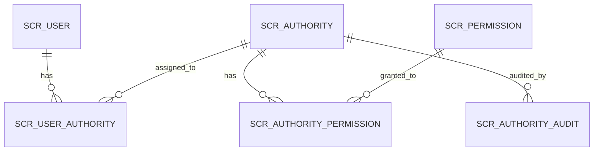

# Detinio

**Detinio** combina "DEmocracia" + "EscruTINIO" - Sistema de escrutinio electoral desarrollado por Tecnología y Servicios Electorales.

**tyseScrutinyGateway**: nombre técnico.

Esta aplicación fue generada usando JHipster 8.11.0, puedes encontrar documentación y ayuda en [https://www.jhipster.tech/documentation-archive/v8.11.0](https://www.jhipster.tech/documentation-archive/v8.11.0).

Esta es una aplicación "gateway" diseñada para ser parte de una arquitectura de microservicios. Para más información, consulta la página [Doing microservices with JHipster][] de la documentación.

Esta aplicación está configurada para Service Discovery y Configuration con Consul. Al iniciar, se negará a arrancar si no puede conectarse a Consul en [http://localhost:8500](http://localhost:8500). Para más información, lee nuestra documentación sobre [Service Discovery and Configuration with Consul][].

## Arquitectura de Microservicios

Este proyecto es parte de una arquitectura de microservicios. La estructura de carpetas recomendada es:

```
tyse/
├── tyse-scrutiny-gateway/          # Este repositorio (Gateway + UI)
│   ├── Puerto: 8080
│   ├── PostgreSQL: localhost:5432
│   └── Frontend React
│
├── tyse-scrutiny-micro-divipol/    # Microservicio de división política
│   ├── Puerto: 8081
│   ├── PostgreSQL: localhost:5433
│   └── API REST pura (sin frontend)
│
└── [futuros microservicios...]
```

### Diagrama de Arquitectura

```
┌─────────────────────────────────────────────────────────────┐
│                   Servicios Compartidos                      │
│  Consul (8500) │ Kafka (9092) │ JHipster Registry (7419)    │
└─────────────────────────────────────────────────────────────┘
                              │
                ┌─────────────┴────────────┐
                │                          │
    ┌───────────▼──────────┐   ┌──────────▼──────────────┐
    │  Gateway (8080)      │   │  Divipol Micro (8081)   │
    │  - React Frontend    │   │  - API REST              │
    │  - Spring Gateway    │   │  - Datos Divipol         │
    │  - Auth JWT          │   │  - 18K registros         │
    │  - PostgreSQL:5432   │   │  - PostgreSQL:5433       │
    └──────────────────────┘   └─────────────────────────┘
```

### Servicios Compartidos

**IMPORTANTE**: Los servicios compartidos (Consul, Kafka) se levantan **UNA SOLA VEZ** desde el gateway:

```bash
# Levantar servicios compartidos (desde el gateway)
docker compose -f src/main/docker/services.yml up -d

# Verificar que están corriendo
docker ps | grep -E "consul|kafka"
```

### Desarrollo con Múltiples Microservicios

**Terminal 1 - Servicios compartidos:**

```bash
cd tyse-scrutiny-gateway
docker compose -f src/main/docker/services.yml up -d
```

**Terminal 2 - Gateway Backend:**

```bash
cd tyse-scrutiny-gateway
./mvnw
```

**Terminal 3 - Gateway Frontend:**

```bash
cd tyse-scrutiny-gateway
./npmw start
```

**Terminal 4 - Microservicio Divipol:**

```bash
cd tyse-scrutiny-micro-divipol
docker compose -f src/main/docker/postgresql.yml up -d  # Solo su PostgreSQL
./mvnw
```

### Tests E2E con Microservicios

Para ejecutar tests E2E que requieren el microservicio divipol, usa `services-e2e.yml` que incluye todos los servicios más el microservicio dockerizado:

```bash
# Construir imagen Docker del microservicio (desde su directorio)
cd ../tyse-scrutiny-micro-divipol
npm run java:docker

# Ejecutar tests E2E (desde el gateway)
cd ../tyse-scrutiny-gateway
./scripts/ci-local.sh --with-e2e
```

El archivo `services-e2e.yml` levanta:

- PostgreSQL (gateway, puerto 5432)
- PostgreSQL Divipol (puerto 5433)
- Consul (puerto 8500)
- Kafka con listeners duales (interno: 9093, externo: 9092)
- MailHog (puerto 8025)
- Microservicio Divipol dockerizado (puerto 8081)

### Comunicación entre Servicios

| Mecanismo     | Uso                                                            |
| ------------- | -------------------------------------------------------------- |
| **Consul**    | Service discovery - Los servicios se registran automáticamente |
| **Kafka**     | Mensajería asíncrona entre servicios                           |
| **HTTP/REST** | Comunicación síncrona vía Spring Cloud Gateway                 |

**Topics Kafka configurados:**

- `sse-topic` - Consumer del microservicio divipol

## Estructura del Proyecto

Node es requerido para la generación y recomendado para desarrollo. `package.json` siempre se genera para una mejor experiencia de desarrollo con prettier, commit hooks, scripts y más.

En la raíz del proyecto, JHipster genera archivos de configuración para herramientas como git, prettier, eslint, husky y otras ampliamente conocidas que puedes consultar en la web.

La estructura `/src/*` sigue la estructura estándar de Java.

- `.yo-rc.json` - Archivo de configuración de Yeoman
  La configuración de JHipster se almacena en este archivo bajo la clave `generator-jhipster`. Puedes encontrar `generator-jhipster-*` para configuraciones específicas de blueprints.
- `.yo-resolve` (opcional) - Resolver de conflictos de Yeoman
  Permite usar una acción específica cuando se encuentran conflictos, omitiendo prompts para archivos que coincidan con un patrón. Cada línea debe coincidir con `[patrón] [acción]` donde patrón es un patrón [Minimatch](https://github.com/isaacs/minimatch#minimatch) y acción es skip (por defecto si se omite) o force. Las líneas que comienzan con `#` se consideran comentarios y se ignoran.
- `.jhipster/*.json` - Archivos de configuración de entidades JHipster

- `npmw` - wrapper para usar npm instalado localmente.
  JHipster instala Node y npm localmente usando la herramienta de compilación por defecto. Este wrapper asegura que npm esté instalado localmente y lo usa evitando diferencias que pueden causar diferentes versiones. Al usar `./npmw` en lugar del tradicional `npm` puedes configurar un entorno sin Node para desarrollar o probar tu aplicación.
- `/src/main/docker` - Configuraciones Docker para la aplicación y servicios de los que depende

## Convenciones de Nomenclatura de Base de Datos

Este proyecto usa el prefijo `scr_` para todas las tablas de base de datos para asegurar portabilidad entre diferentes sistemas de gestión de bases de datos y evitar conflictos con palabras reservadas.

### Prefijo: `scr_`

**Significado:** **Scr**utiny (abreviación de Tyse Scrutiny Gateway)

**Justificación:**

- **Portabilidad:** La palabra `user` es una palabra reservada en PostgreSQL, MySQL, Oracle, SQL Server y H2. Usar el prefijo `scr_` asegura que nuestro esquema funcione sin problemas en todos los principales sistemas de bases de datos sin requerir comillas, backticks o corchetes.
- **Claridad de Namespace:** Todas las tablas de la aplicación están claramente identificadas con el prefijo `scr_`, facilitando a los DBAs distinguirlas de tablas del sistema o tablas de otras aplicaciones.
- **A Prueba de Futuro:** Si la base de datos se comparte con otras aplicaciones en el futuro, el prefijo previene colisiones de nombres de tablas.
- **Compatibilidad con Liquibase:** Se adhiere a la filosofía de Liquibase de migraciones agnósticas de base de datos.

### Estándar de Nomenclatura

Todos los nombres de tablas siguen este patrón:

```
scr_[nombre_descriptivo]
```

**Ejemplos:**

- `scr_user` - Cuentas de usuario
- `scr_authority` - Roles/autoridades
- `scr_permission` - Permisos granulares
- `scr_user_authority` - Asignaciones usuario-rol
- `scr_authority_permission` - Mapeos rol-permiso
- `scr_authority_audit` - Registro de auditoría para cambios de autoridad

**Reglas:**

- Usar sustantivos en **singular** para nombres de tablas (ej., `scr_user`, no `scr_users`)
- Usar **snake_case** para nombres de múltiples palabras (ej., `scr_user_authority`)
- Siempre usar minúsculas
- Mantener nombres descriptivos pero concisos

### Mapeo de Entidades

En las clases de entidad Java, la anotación `@Table` mapea a estos nombres de tabla con prefijo:

```java
@Table("scr_user")
public class User extends AbstractAuditingEntity<Long> { ... }

@Table("scr_authority")
public class Authority extends AbstractAuditingEntity<Long> { ... }
```

## Gestión de Base de Datos con Liquibase

Este proyecto usa Liquibase para control de versiones de base de datos y gestión de migraciones. Los tags permiten rollback controlado a estados específicos de la base de datos.

### Aplicar Cambios de Base de Datos

**Aplicar todos los changesets pendientes:**

```bash
./mvnw liquibase:update
```

Este comando:

- ✅ Aplica todos los changesets no aplicados desde `master.xml`
- ✅ Crea tags de base de datos automáticamente
- ✅ Actualiza la tabla de seguimiento `databasechangelog`
- ✅ Seguro para ejecutar múltiples veces (idempotente)

### Tags de Base de Datos Disponibles

Los tags son instantáneas del estado de la base de datos en puntos específicos del historial de migración:

- **`estado-vacio`** - Base de datos vacía (sin tablas de aplicación, solo tablas de control de Liquibase)
- **`sistema-autorizacion`** - Sistema completo de autorización enterprise con:
  - 6 tablas de autorización (scr_authority, scr_permission, scr_authority_permission, scr_user_authority, scr_user_permission, scr_authority_audit)
  - Datos semilla cargados (2 roles, 13 permisos, 16 mapeos)
  - Claves foráneas e índices configurados

### Comandos de Rollback

**Volver a la instantánea del sistema de autorización:**

```bash
./mvnw liquibase:rollback -Dliquibase.rollbackTag=sistema-autorizacion
```

**Volver a base de datos vacía (rollback controlado):**

```bash
./mvnw liquibase:rollback -Dliquibase.rollbackTag=estado-vacio
```

El rollback:

- ✅ Ejecuta changesets de rollback en orden inverso
- ✅ Respeta dependencias de claves foráneas
- ✅ Deja intactas las tablas de control de Liquibase
- ✅ Mantiene el historial de migración para futura re-aplicación

**Borrado completo de base de datos (destructivo):**

```bash
./mvnw liquibase:dropAll
```

⚠️ **Advertencia:** Esto:

- ❌ Elimina TODOS los objetos de base de datos directamente (sin ejecutar changesets)
- ❌ Remueve incluso las tablas de control de Liquibase
- ❌ Destruye todo el historial de migración
- Usar solo para escenarios de reset completo

### Comparación Rollback vs DropAll

| Comando                                  | Método                       | Reversible | Mantiene Historial | Recomendado         |
| ---------------------------------------- | ---------------------------- | ---------- | ------------------ | ------------------- |
| `rollback -Dliquibase.rollbackTag=<tag>` | Ejecuta bloques `<rollback>` | ✅ Sí      | ✅ Sí              | ✅ **Preferido**    |
| `dropAll`                                | Statements DROP directos     | ❌ No      | ❌ No              | ⚠️ Usar con cuidado |

**Recomendación:** Siempre usar `rollback` para mantener control e historial. Usar `dropAll` solo cuando necesites un reset completo.

## Sistema de Autorización Enterprise

Tyse Scrutiny Gateway implementa un sistema de autorización avanzado basado en **RBAC (Role-Based Access Control)** con características enterprise.

### Características Principales

- ✅ **Roles jerárquicos** con metadatos (hierarchy_level, category)
- ✅ **Permisos granulares** (patrón `resource.action`)
- ✅ **Asignaciones temporales** de roles con expiración automática
- ✅ **Permisos directos** a usuarios (bypass de roles)
- ✅ **Auditoría completa** (todos los cambios registrados con IP, User-Agent)
- ✅ **Dashboard interactivo** con métricas y alertas
- ✅ **Exportación** de logs de auditoría (CSV/JSON)
- ✅ **API REST completa** con Swagger/OpenAPI
- ✅ **Frontend React** con Redux Toolkit
- ✅ **Programación reactiva** (Spring WebFlux + R2DBC)

### Arquitectura

**6 tablas principales:**

- `scr_authority` - Roles del sistema
- `scr_permission` - Permisos granulares
- `scr_authority_permission` - Relación N:N roles-permisos
- `scr_user_authority` - Asignaciones user-rol (con expiración)
- `scr_user_permission` - Permisos directos
- `scr_authority_audit` - Log completo de cambios

**8 servicios backend:**

- AuthorityService, PermissionService, UserAuthorityService
- AuthorityAuditService, AuthorizationDashboardService, AuditExportService

**6 REST controllers:**

- `/api/authorities`, `/api/permissions`, `/api/user-authorities`
- `/api/authorization/dashboard`, `/api/authority-audits`

**Frontend completo:**

- 14 componentes UI (Authority, Permission, User Authority CRUD)
- Dashboard con 5 widgets (métricas, actividad reciente, alertas, gráficos)
- Redux slices con 21+ async thunks
- i18n completo (ES + EN) con 150+ claves

### Quick Start

**Acceder a la UI de administración:**

```bash
# 1. Iniciar aplicación
./mvnw

# 2. En navegador, ir a:
http://localhost:8080/admin/authority           # Gestión de roles
http://localhost:8080/admin/permission          # Gestión de permisos
http://localhost:8080/admin/authorization-dashboard  # Dashboard de métricas
```

**Requisitos:**

- Usuario con rol `ROLE_ADMIN`
- Credenciales por defecto: `admin` / `admin`

**Documentación de API:**

```bash
# Swagger UI
http://localhost:8080/swagger-ui.html

# Referencia de API completa
docs/authorization/api/AUTHORIZATION_API_REFERENCE.md
```

### Datos Iniciales

**Roles del sistema (seed data):**

- `ROLE_ADMIN` (id=1) - Administrador con acceso total
- `ROLE_USER` (id=2) - Usuario estándar

**Permisos base (13 permisos):**

- `user.create`, `user.read`, `user.update`, `user.delete`
- `authority.create`, `authority.read`, `authority.update`, `authority.delete`, `authority.assign`
- `permission.create`, `permission.read`, `permission.update`, `permission.delete`

### Scheduled Jobs

**ExpiredAuthoritiesCleanupJob:**

- **Cron:** Diario a las 2 AM (`0 0 2 * * *`)
- **Función:** Marca como `is_active=false` los roles y permisos directos expirados
- **Logs:** `grep "ExpiredAuthoritiesCleanupJob" logs/spring.log`

### Documentación Completa

| Documento                                                                        | Descripción                            | Audiencia     |
| -------------------------------------------------------------------------------- | -------------------------------------- | ------------- |
| [Manual de Usuario](docs/authorization/user-manual/AUTHORIZATION_ADMIN_GUIDE.md) | Guía completa para administradores     | Admins        |
| [FAQ](docs/authorization/FAQ.md)                                                 | 15 preguntas frecuentes                | Todos         |
| [Troubleshooting](docs/authorization/TROUBLESHOOTING.md)                         | 15 problemas comunes y soluciones      | Soporte       |
| [Guía de Operaciones](docs/authorization/operations/AUTHORIZATION_OPS_GUIDE.md)  | Arquitectura, DB, monitoreo, backup    | SysOps/DevOps |
| [Referencia de API](docs/authorization/api/AUTHORIZATION_API_REFERENCE.md)       | Especificación completa de endpoints   | Developers    |
| [Diagramas](docs/authorization/diagrams/)                                        | ER, flujo de autorización, componentes | Arquitectos   |

### Testing

**Backend (67 tests de integración):**

```bash
./mvnw verify  # Ejecutar todos los tests
```

**Frontend (pendiente):**

```bash
./npmw test  # Jest + React Testing Library
```

### Ejemplos de Uso

**Crear un rol personalizado:**

```bash
curl -X POST "http://localhost:8080/api/authorities" \
  -H "Authorization: Bearer YOUR_JWT" \
  -H "Content-Type: application/json" \
  -d '{
    "name": "Manager",
    "code": "ROLE_MANAGER",
    "description": "Can manage teams and view reports",
    "category": "CUSTOM",
    "isActive": true,
    "hierarchyLevel": 100
  }'
```

**Asignar rol temporal (30 días):**

```bash
curl -X POST "http://localhost:8080/api/user-authorities" \
  -H "Authorization: Bearer YOUR_JWT" \
  -H "Content-Type: application/json" \
  -d '{
    "userId": 123,
    "authorityId": 3,
    "expiresAt": "2025-12-07T23:59:59Z"
  }'
```

**Ver métricas del dashboard:**

```bash
curl -X GET "http://localhost:8080/api/authorization/dashboard/metrics" \
  -H "Authorization: Bearer YOUR_JWT"
```

### Diagramas

**Diagrama ER (6 tablas):**



Ver diagrama completo en [docs/authorization/diagrams/database-er-diagram.md](docs/authorization/diagrams/database-er-diagram.md)

**Flujo de Autorización:**

Ver diagramas de secuencia en [docs/authorization/diagrams/authorization-flow.md](docs/authorization/diagrams/authorization-flow.md)

**Arquitectura de Componentes:**

Ver diagrama de componentes en [docs/authorization/diagrams/component-architecture.md](docs/authorization/diagrams/component-architecture.md)

### Migración y Rollback

**Aplicar sistema de autorización:**

```bash
./mvnw liquibase:update
```

**Rollback al snapshot de autorización:**

```bash
./mvnw liquibase:rollback -Dliquibase.rollbackTag=sistema-autorizacion
```

**Rollback a BD vacía:**

```bash
./mvnw liquibase:rollback -Dliquibase.rollbackTag=estado-vacio
```

### Configuración de Producción

**Variables de entorno importantes:**

```yaml
# JWT secret (cambiar en producción)
JHIPSTER_SECURITY_AUTHENTICATION_JWT_BASE64_SECRET: [generated-secret]

# Database
SPRING_R2DBC_URL: r2dbc:postgresql://db-host:5432/tysescrutinygateway
SPRING_R2DBC_USERNAME: tyse_app
SPRING_R2DBC_PASSWORD: [secure-password]

# Scheduled jobs
SPRING_TASK_SCHEDULING_ENABLED: true
```

**Backup recomendado:**

```bash
# Backup de tablas de autorización
pg_dump -U postgres tysescrutinygateway -t "scr_*" > backup_auth.sql

# Restore
psql -U postgres tysescrutinygateway < backup_auth.sql
```

### Monitoreo

**Métricas (Prometheus/Actuator):**

```bash
# Endpoint de métricas
curl http://localhost:8080/actuator/metrics

# Métricas específicas de autorización
curl http://localhost:8080/api/authorization/dashboard/metrics
```

**Logs importantes:**

```bash
# Auditoría de cambios
grep "AuthorityService" logs/spring.log

# Scheduled job execution
grep "ExpiredAuthoritiesCleanupJob" logs/spring.log

# Errores de autorización
grep "Access Denied" logs/spring.log
```

### Seguridad

- **Todos los endpoints** requieren autenticación JWT con rol `ROLE_ADMIN`
- **Roles de sistema** (`ROLE_ADMIN`, `ROLE_USER`) están protegidos contra modificación/eliminación
- **Auditoría completa** captura IP address, User-Agent, timestamp, old/new values
- **Validaciones estrictas** en backend y frontend
- **Soft delete** para roles y permisos (preserva historial)

### Contribuir

Para extender el sistema de autorización:

1. **Agregar nuevo permiso:**

   - UI: `/admin/permission` → "Create new Permission"
   - API: `POST /api/permissions` con `{resource, action, description}`

2. **Crear nuevo rol:**

   - UI: `/admin/authority` → "Create new Authority"
   - API: `POST /api/authorities` con `{name, code, category, hierarchyLevel}`

3. **Asignar permisos al rol:**
   - UI: Ver detalle del rol → "Permissions" → "Add Permission"
   - API: `POST /api/authority-permissions` con `{authorityId, permissionId}`

### Soporte

**Problemas comunes:**

- Ver [docs/authorization/TROUBLESHOOTING.md](docs/authorization/TROUBLESHOOTING.md)

**Preguntas frecuentes:**

- Ver [docs/authorization/FAQ.md](docs/authorization/FAQ.md)

**Reportar issues:**

- GitHub Issues del proyecto
- Email: [soporte-técnico]

---

## Desarrollo

### Puertos

Esta aplicación: 8080
Micro divipol: 8081

### Desarrollo API-First usando openapi-generator-cli

[OpenAPI-Generator]() está configurado para esta aplicación. Puedes generar código de API desde el archivo de definición `src/main/resources/swagger/api.yml` ejecutando:

```bash
./mvnw generate-sources
```

Luego implementa las clases delegadas generadas con clases `@Service`.

Para editar el archivo de definición `api.yml`, puedes usar una herramienta como [Swagger-Editor](). Inicia una instancia local del swagger-editor usando docker ejecutando: `docker compose -f src/main/docker/swagger-editor.yml up -d`. El editor estará disponible en [http://localhost:7742](http://localhost:7742).

Consulta [Doing API-First development][] para más detalles.
El sistema de compilación instalará automáticamente la versión recomendada de Node y npm.

Proporcionamos un wrapper para lanzar npm.
Solo necesitarás ejecutar este comando cuando cambien las dependencias en [package.json](package.json).

```
./npmw install
```

Usamos scripts de npm y [Webpack][] como nuestro sistema de compilación.

Ejecuta los siguientes comandos en dos terminales separadas para crear una experiencia de desarrollo placentera donde tu navegador
se auto-actualiza cuando los archivos cambian en tu disco duro.

```
./mvnw
./npmw start
```

Npm también se usa para gestionar dependencias CSS y JavaScript usadas en esta aplicación. Puedes actualizar dependencias
especificando una versión más nueva en [package.json](package.json). También puedes ejecutar `./npmw update` y `./npmw install` para gestionar dependencias.
Agrega la bandera `help` en cualquier comando para ver cómo usarlo. Por ejemplo, `./npmw help update`.

El comando `./npmw run` listará todos los scripts disponibles para ejecutar en este proyecto.

### Soporte PWA

JHipster viene con soporte PWA (Progressive Web App), y está desactivado por defecto. Uno de los componentes principales de una PWA es un service worker.

El código de inicialización del service worker está comentado por defecto. Para habilitarlo, descomenta el siguiente código en `src/main/webapp/index.html`:

```html
<script>
  if ('serviceWorker' in navigator) {
    navigator.serviceWorker.register('./service-worker.js').then(function () {
      console.log('Service Worker Registered');
    });
  }
</script>
```

Nota: [Workbox](https://developers.google.com/web/tools/workbox/) impulsa el service worker de JHipster. Genera dinámicamente el archivo `service-worker.js`.

### Gestión de dependencias

Por ejemplo, para agregar la librería [Leaflet][] como una dependencia de runtime de tu aplicación, ejecutarías el siguiente comando:

```
./npmw install --save --save-exact leaflet
```

Para beneficiarte de las definiciones de tipos TypeScript del repositorio [DefinitelyTyped][] en desarrollo, ejecutarías el siguiente comando:

```
./npmw install --save-dev --save-exact @types/leaflet
```

Luego importarías los archivos JS y CSS especificados en las instrucciones de instalación de la librería para que [Webpack][] los conozca:
Nota: Todavía quedan algunas otras cosas por hacer para Leaflet que no detallaremos aquí.

Para más instrucciones sobre cómo desarrollar con JHipster, consulta [Using JHipster in development][].

### Linting y Formateo de Código

Este proyecto usa ESLint y Prettier para mantener la calidad del código y un formateo consistente.

#### Verificar problemas de linting

```bash
npm run lint
```

#### Corregir automáticamente problemas de linting

```bash
npm run lint:fix
```

Este comando corregirá automáticamente la mayoría de problemas de formateo de ESLint y Prettier. Es particularmente útil cuando encuentras errores de compilación relacionados con el formateo del código.

#### Verificar formateo de código con Prettier

```bash
npm run prettier:check
```

#### Formatear código con Prettier

```bash
npm run prettier:format
```

**Nota**: Si encuentras errores de compilación mencionando `prettier/prettier` o `object-shorthand`, ejecutar `npm run lint:fix` típicamente los resolverá automáticamente.

### Guías de Estilo

#### Variables de Color

**IMPORTANTE**: Todos los archivos SCSS deben usar variables de color definidas en `src/main/webapp/app/_color-variables.scss` en lugar de valores de color hardcodeados.

❌ **Incorrecto** (colores hardcodeados):

```scss
.my-component {
  color: #333;
  background: #fff;
  border: 1px solid #eee;
}
```

✅ **Correcto** (usando variables):

```scss
@import '../../color-variables';

.my-component {
  color: $color-text-primary;
  background: $color-white;
  border: 1px solid $color-gray-light;
}
```

**Beneficios**:

- Asegura tematización consistente en modos claro y oscuro
- Hace los cambios de color centralizados y más fáciles de mantener
- Mejora la accesibilidad y consistencia visual

**Categorías de colores disponibles**:

- Colores base: `$color-white`, `$color-black`, grises
- Colores de texto: `$color-text-primary`, `$color-text-secondary`, `$color-text-tertiary`
- Colores de estado: `$color-danger`, `$color-warning`, `$color-success`
- Colores de sombra: variantes `$color-shadow-*`
- Colores de tema oscuro: variantes `$color-dark-overlay-*`

Ver `src/main/webapp/app/_color-variables.scss` para la lista completa de variables disponibles.

## Compilación para producción

### Empaquetado como jar

Para compilar el jar final y optimizar la aplicación tyseScrutinyGateway para producción, ejecuta:

```
./mvnw -Pprod clean verify
```

Esto concatenará y minificará los archivos CSS y JavaScript del cliente. También modificará `index.html` para que haga referencia a estos nuevos archivos.
Para asegurar que todo funcionó, ejecuta:

```
java -jar target/*.jar
```

Luego navega a [http://localhost:8080](http://localhost:8080) en tu navegador.

Consulta [Using JHipster in production][] para más detalles.

### Empaquetado como war

Para empaquetar tu aplicación como un war para desplegarla en un servidor de aplicaciones, ejecuta:

```
./mvnw -Pprod,war clean verify
```

### JHipster Control Center

JHipster Control Center puede ayudarte a gestionar y controlar tus aplicaciones. Puedes iniciar un servidor de control center local (accesible en http://localhost:7419) con:

```
docker compose -f src/main/docker/jhipster-control-center.yml up
```

## Testing

### Tests de Spring Boot

Para lanzar los tests de tu aplicación, ejecuta:

```
./mvnw verify
```

### Gatling

Los tests de rendimiento son ejecutados por [Gatling][] y escritos en Scala. Están ubicados en [src/test/java/gatling/simulations](src/test/java/gatling/simulations).

Puedes ejecutar todos los tests de Gatling con

```
./mvnw gatling:test
```

### Tests de Cliente

Los tests unitarios son ejecutados por [Jest][]. Están ubicados cerca de los componentes y pueden ejecutarse con:

```
./npmw test
```

Los tests end-to-end de UI son potenciados por [Cypress][]. Están ubicados en [src/test/javascript/cypress](src/test/javascript/cypress)
y pueden ejecutarse iniciando Spring Boot en una terminal (`./mvnw spring-boot:run`) y ejecutando los tests (`./npmw run e2e`) en una segunda.

#### Auditorías Lighthouse

Puedes ejecutar [auditorías Lighthouse](https://developers.google.com/web/tools/lighthouse/) automatizadas con [cypress-audit](https://github.com/mfrachet/cypress-audit) ejecutando `./npmw run e2e:cypress:audits`.
Solo deberías ejecutar las auditorías cuando tu aplicación esté empaquetada con el perfil de producción.
El reporte de lighthouse se crea en `target/cypress/lhreport.html`

### Troubleshooting de Tests

Si encuentras problemas ejecutando los tests (especialmente tests de integración con Testcontainers), consulta el archivo [TROUBLESHOOTING.md](TROUBLESHOOTING.md) que contiene soluciones a problemas comunes conocidos.

## Otros

### Calidad de código usando Sonar

Sonar se usa para analizar la calidad del código. Puedes iniciar un servidor Sonar local (accesible en http://localhost:9001) con:

```
docker compose -f src/main/docker/sonar.yml up -d
```

Nota: hemos desactivado el redireccionamiento forzado de autenticación para la UI en [src/main/docker/sonar.yml](src/main/docker/sonar.yml) para una experiencia lista para usar mientras pruebas SonarQube, para casos de uso reales actívalo nuevamente.

Puedes ejecutar un análisis de Sonar usando el [sonar-scanner](https://docs.sonarqube.org/display/SCAN/Analyzing+with+SonarQube+Scanner) o usando el plugin de maven.

Luego, ejecuta un análisis de Sonar:

```
./mvnw -Pprod clean verify sonar:sonar -Dsonar.login=admin -Dsonar.password=admin
```

Si necesitas re-ejecutar la fase de Sonar, asegúrate de especificar al menos la fase `initialize` ya que las propiedades de Sonar se cargan desde el archivo sonar-project.properties.

```
./mvnw initialize sonar:sonar -Dsonar.login=admin -Dsonar.password=admin
```

Adicionalmente, en lugar de pasar `sonar.password` y `sonar.login` como argumentos CLI, estos parámetros pueden configurarse desde [sonar-project.properties](sonar-project.properties) como se muestra a continuación:

```
sonar.login=admin
sonar.password=admin
```

Para más información, consulta la [Code quality page][].

### Soporte Docker Compose

JHipster genera varios archivos de configuración Docker Compose en la carpeta [src/main/docker/](src/main/docker/) para lanzar servicios de terceros requeridos.

Por ejemplo, para iniciar los servicios requeridos en contenedores Docker, ejecuta:

```
docker compose -f src/main/docker/services.yml up -d
```

Para detener y remover los contenedores, ejecuta:

```
docker compose -f src/main/docker/services.yml down
```

[Spring Docker Compose Integration](https://docs.spring.io/spring-boot/reference/features/dev-services.html) está habilitado por defecto. Es posible deshabilitarlo en application.yml:

```yaml
spring:
  ...
  docker:
    compose:
      enabled: false
```

También puedes dockerizar completamente tu aplicación y todos los servicios de los que depende.
Para lograr esto, primero construye una imagen Docker de tu aplicación ejecutando:

```sh
npm run java:docker
```

O construye una imagen Docker arm64 cuando uses un procesador arm64 como MacOS con familia de procesadores M1 ejecutando:

```sh
npm run java:docker:arm64
```

Luego ejecuta:

```sh
docker compose -f src/main/docker/app.yml up -d
```

Para más información consulta [Using Docker and Docker-Compose][], esta página también contiene información sobre el sub-generador Docker Compose (`jhipster docker-compose`), que puede generar configuraciones Docker para una o varias aplicaciones JHipster.

#### Testing de Email con MailHog

Para **desarrollo local**, la aplicación usa MailHog (o MailDev) corriendo en `localhost:1025` para capturar emails. Para iniciar MailHog localmente:

```bash
docker run -d -p 1025:1025 -p 8025:8025 mailhog/mailhog:v1.0.1
```

Accede a la interfaz web de MailHog en [http://localhost:8025](http://localhost:8025) para ver los emails capturados.

Para **entorno de staging**, MailHog ya está configurado en el setup de Docker Compose. Los usuarios con acceso VPN pueden ver los emails en:

- **URL de Staging**: `192.168.0.58:8035` (vía navegador con VPN)

Todos los emails enviados por la aplicación (activación de usuario, reset de contraseña, etc.) son automáticamente capturados y pueden verse a través de esta interfaz. No se requiere servidor de email real ni credenciales.

## Integración Continua (opcional)

Para configurar CI para tu proyecto, ejecuta el sub-generador ci-cd (`jhipster ci-cd`), esto te permitirá generar archivos de configuración para varios sistemas de Integración Continua. Consulta la página [Setting up Continuous Integration][] para más información.

[JHipster Homepage and latest documentation]: https://www.jhipster.tech
[JHipster 8.11.0 archive]: https://www.jhipster.tech/documentation-archive/v8.11.0
[Doing microservices with JHipster]: https://www.jhipster.tech/documentation-archive/v8.11.0/microservices-architecture/
[Using JHipster in development]: https://www.jhipster.tech/documentation-archive/v8.11.0/development/
[Service Discovery and Configuration with Consul]: https://www.jhipster.tech/documentation-archive/v8.11.0/microservices-architecture/#consul
[Using Docker and Docker-Compose]: https://www.jhipster.tech/documentation-archive/v8.11.0/docker-compose
[Using JHipster in production]: https://www.jhipster.tech/documentation-archive/v8.11.0/production/
[Running tests page]: https://www.jhipster.tech/documentation-archive/v8.11.0/running-tests/
[Code quality page]: https://www.jhipster.tech/documentation-archive/v8.11.0/code-quality/
[Setting up Continuous Integration]: https://www.jhipster.tech/documentation-archive/v8.11.0/setting-up-ci/
[Node.js]: https://nodejs.org/
[NPM]: https://www.npmjs.com/
[OpenAPI-Generator]: https://openapi-generator.tech
[Swagger-Editor]: https://editor.swagger.io
[Doing API-First development]: https://www.jhipster.tech/documentation-archive/v8.11.0/doing-api-first-development/
[Gatling]: https://gatling.io/
[Webpack]: https://webpack.github.io/
[BrowserSync]: https://www.browsersync.io/
[Jest]: https://jestjs.io
[Cypress]: https://www.cypress.io/
[Leaflet]: https://leafletjs.com/
[DefinitelyTyped]: https://definitelytyped.org/
