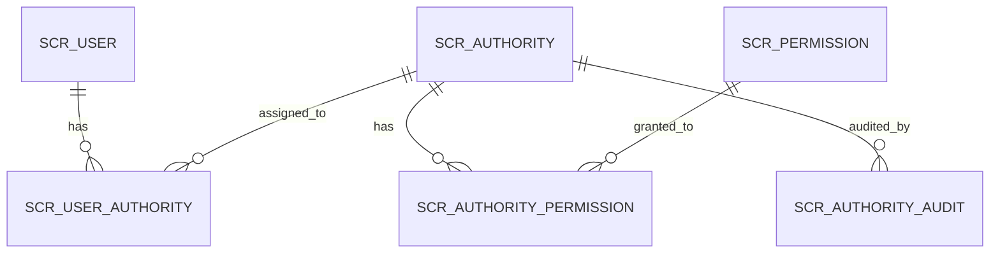

# tyseScrutinyGateway

This application was generated using JHipster 8.11.0, you can find documentation and help at [https://www.jhipster.tech/documentation-archive/v8.11.0](https://www.jhipster.tech/documentation-archive/v8.11.0).

This is a "gateway" application intended to be part of a microservice architecture, please refer to the [Doing microservices with JHipster][] page of the documentation for more information.

This application is configured for Service Discovery and Configuration with Consul. On launch, it will refuse to start if it is not able to connect to Consul at [http://localhost:8500](http://localhost:8500). For more information, read our documentation on [Service Discovery and Configuration with Consul][].

## Project Structure

Node is required for generation and recommended for development. `package.json` is always generated for a better development experience with prettier, commit hooks, scripts and so on.

In the project root, JHipster generates configuration files for tools like git, prettier, eslint, husky, and others that are well known and you can find references in the web.

`/src/*` structure follows default Java structure.

- `.yo-rc.json` - Yeoman configuration file
  JHipster configuration is stored in this file at `generator-jhipster` key. You may find `generator-jhipster-*` for specific blueprints configuration.
- `.yo-resolve` (optional) - Yeoman conflict resolver
  Allows to use a specific action when conflicts are found skipping prompts for files that matches a pattern. Each line should match `[pattern] [action]` with pattern been a [Minimatch](https://github.com/isaacs/minimatch#minimatch) pattern and action been one of skip (default if omitted) or force. Lines starting with `#` are considered comments and are ignored.
- `.jhipster/*.json` - JHipster entity configuration files

- `npmw` - wrapper to use locally installed npm.
  JHipster installs Node and npm locally using the build tool by default. This wrapper makes sure npm is installed locally and uses it avoiding some differences different versions can cause. By using `./npmw` instead of the traditional `npm` you can configure a Node-less environment to develop or test your application.
- `/src/main/docker` - Docker configurations for the application and services that the application depends on

## Database Naming Conventions

This project uses the `scr_` prefix for all database tables to ensure portability across different database management systems and avoid conflicts with reserved keywords.

### Prefix: `scr_`

**Meaning:** **Scr**utiny (short for Tyse Scrutiny Gateway)

**Rationale:**

- **Portability:** The word `user` is a reserved keyword in PostgreSQL, MySQL, Oracle, SQL Server, and H2. Using the `scr_` prefix ensures our schema works seamlessly across all major database systems without requiring quotes, backticks, or brackets.
- **Namespace Clarity:** All application tables are clearly identified with the `scr_` prefix, making it easy for DBAs to distinguish them from system tables or tables from other applications.
- **Future-Proof:** If the database is shared with other applications in the future, the prefix prevents table name collisions.
- **Liquibase Compatibility:** Adheres to Liquibase's philosophy of database-agnostic migrations.

### Naming Standard

All table names follow this pattern:

```
scr_[descriptive_name]
```

**Examples:**

- `scr_user` - User accounts
- `scr_authority` - Roles/authorities
- `scr_permission` - Granular permissions
- `scr_user_authority` - User-role assignments
- `scr_authority_permission` - Role-permission mappings
- `scr_authority_audit` - Audit log for authority changes

**Rules:**

- Use **singular** nouns for table names (e.g., `scr_user`, not `scr_users`)
- Use **snake_case** for multi-word names (e.g., `scr_user_authority`)
- Always use lowercase
- Keep names descriptive but concise

### Entity Mapping

In Java entity classes, the `@Table` annotation maps to these prefixed table names:

```java
@Table("scr_user")
public class User extends AbstractAuditingEntity<Long> { ... }

@Table("scr_authority")
public class Authority extends AbstractAuditingEntity<Long> { ... }
```

## Liquibase Database Management

This project uses Liquibase for database version control and migration management. Tags enable controlled rollback to specific database states.

### Apply Database Changes

**Apply all pending changesets:**

```bash
./mvnw liquibase:update
```

This command:

- ✅ Applies all unapplied changesets from `master.xml`
- ✅ Creates database tags automatically
- ✅ Updates the `databasechangelog` tracking table
- ✅ Safe to run multiple times (idempotent)

### Available Database Tags

Tags are snapshots of the database state at specific points in the migration history:

- **`estado-vacio`** - Empty database (no application tables, only Liquibase control tables)
- **`sistema-autorizacion`** - Complete enterprise authorization system with:
  - 6 authorization tables (scr_authority, scr_permission, scr_authority_permission, scr_user_authority, scr_user_permission, scr_authority_audit)
  - Seed data loaded (2 roles, 13 permissions, 16 mappings)
  - Foreign keys and indexes configured

### Rollback Commands

**Return to authorization system snapshot:**

```bash
./mvnw liquibase:rollback -Dliquibase.rollbackTag=sistema-autorizacion
```

**Return to empty database (controlled rollback):**

```bash
./mvnw liquibase:rollback -Dliquibase.rollbackTag=estado-vacio
```

Rollback will:

- ✅ Execute rollback changesets in reverse order
- ✅ Respect foreign key dependencies
- ✅ Leave Liquibase control tables intact
- ✅ Maintain migration history for future re-application

**Complete database wipe (destructive):**

```bash
./mvnw liquibase:dropAll
```

⚠️ **Warning:** This will:

- ❌ Drop ALL database objects directly (no changeset execution)
- ❌ Remove even Liquibase control tables
- ❌ Destroy all migration history
- Use only for complete reset scenarios

### Rollback vs DropAll Comparison

| Command                                  | Method                       | Reversible | Keeps History | Recommended         |
| ---------------------------------------- | ---------------------------- | ---------- | ------------- | ------------------- |
| `rollback -Dliquibase.rollbackTag=<tag>` | Executes `<rollback>` blocks | ✅ Yes     | ✅ Yes        | ✅ **Preferred**    |
| `dropAll`                                | Direct DROP statements       | ❌ No      | ❌ No         | ⚠️ Use with caution |

**Recommendation:** Always use `rollback` to maintain control and history. Use `dropAll` only when you need a complete reset.

## Sistema de Autorización Enterprise

Tyse Scrutiny Gateway implementa un sistema de autorización avanzado basado en **RBAC (Role-Based Access Control)** con características enterprise.

### Características Principales

- ✅ **Roles jerárquicos** con metadatos (hierarchy_level, category)
- ✅ **Permisos granulares** (patrón `resource.action`)
- ✅ **Asignaciones temporales** de roles con expiración automática
- ✅ **Permisos directos** a usuarios (bypass de roles)
- ✅ **Auditoría completa** (todos los cambios registrados con IP, User-Agent)
- ✅ **Dashboard interactivo** con métricas y alertas
- ✅ **Exportación** de logs de auditoría (CSV/JSON)
- ✅ **API REST completa** con Swagger/OpenAPI
- ✅ **Frontend React** con Redux Toolkit
- ✅ **Programación reactiva** (Spring WebFlux + R2DBC)

### Arquitectura

**6 tablas principales:**

- `scr_authority` - Roles del sistema
- `scr_permission` - Permisos granulares
- `scr_authority_permission` - Relación N:N roles-permisos
- `scr_user_authority` - Asignaciones user-rol (con expiración)
- `scr_user_permission` - Permisos directos
- `scr_authority_audit` - Log completo de cambios

**8 servicios backend:**

- AuthorityService, PermissionService, UserAuthorityService
- AuthorityAuditService, AuthorizationDashboardService, AuditExportService

**6 REST controllers:**

- `/api/authorities`, `/api/permissions`, `/api/user-authorities`
- `/api/authorization/dashboard`, `/api/authority-audits`

**Frontend completo:**

- 14 componentes UI (Authority, Permission, User Authority CRUD)
- Dashboard con 5 widgets (métricas, actividad reciente, alertas, gráficos)
- Redux slices con 21+ async thunks
- i18n completo (ES + EN) con 150+ claves

### Quick Start

**Acceder a la UI de administración:**

```bash
# 1. Iniciar aplicación
./mvnw

# 2. En navegador, ir a:
http://localhost:8080/admin/authority           # Gestión de roles
http://localhost:8080/admin/permission          # Gestión de permisos
http://localhost:8080/admin/authorization-dashboard  # Dashboard de métricas
```

**Requisitos:**

- Usuario con rol `ROLE_ADMIN`
- Credenciales por defecto: `admin` / `admin`

**API Documentation:**

```bash
# Swagger UI
http://localhost:8080/swagger-ui.html

# API Reference completa
docs/api/AUTHORIZATION_API_REFERENCE.md
```

### Datos Iniciales

**Roles del sistema (seed data):**

- `ROLE_ADMIN` (id=1) - Administrador con acceso total
- `ROLE_USER` (id=2) - Usuario estándar

**Permisos base (13 permisos):**

- `user.create`, `user.read`, `user.update`, `user.delete`
- `authority.create`, `authority.read`, `authority.update`, `authority.delete`, `authority.assign`
- `permission.create`, `permission.read`, `permission.update`, `permission.delete`

### Scheduled Jobs

**ExpiredAuthoritiesCleanupJob:**

- **Cron:** Diario a las 2 AM (`0 0 2 * * *`)
- **Función:** Marca como `is_active=false` los roles y permisos directos expirados
- **Logs:** `grep "ExpiredAuthoritiesCleanupJob" logs/spring.log`

### Documentación Completa

| Documento                                                          | Descripción                            | Audiencia     |
| ------------------------------------------------------------------ | -------------------------------------- | ------------- |
| [Manual de Usuario](docs/user-manual/AUTHORIZATION_ADMIN_GUIDE.md) | Guía completa para administradores     | Admins        |
| [FAQ](docs/FAQ.md)                                                 | 15 preguntas frecuentes                | Todos         |
| [Troubleshooting](docs/TROUBLESHOOTING.md)                         | 15 problemas comunes y soluciones      | Soporte       |
| [Guía de Operaciones](docs/operations/AUTHORIZATION_OPS_GUIDE.md)  | Arquitectura, DB, monitoreo, backup    | SysOps/DevOps |
| [API Reference](docs/api/AUTHORIZATION_API_REFERENCE.md)           | Especificación completa de endpoints   | Developers    |
| [Diagramas](docs/diagrams/)                                        | ER, flujo de autorización, componentes | Arquitectos   |

### Testing

**Backend (67 tests de integración):**

```bash
./mvnw verify  # Ejecutar todos los tests
```

**Frontend (pendiente):**

```bash
./npmw test  # Jest + React Testing Library
```

### Ejemplos de Uso

**Crear un rol personalizado:**

```bash
curl -X POST "http://localhost:8080/api/authorities" \
  -H "Authorization: Bearer YOUR_JWT" \
  -H "Content-Type: application/json" \
  -d '{
    "name": "Manager",
    "code": "ROLE_MANAGER",
    "description": "Can manage teams and view reports",
    "category": "CUSTOM",
    "isActive": true,
    "hierarchyLevel": 100
  }'
```

**Asignar rol temporal (30 días):**

```bash
curl -X POST "http://localhost:8080/api/user-authorities" \
  -H "Authorization: Bearer YOUR_JWT" \
  -H "Content-Type: application/json" \
  -d '{
    "userId": 123,
    "authorityId": 3,
    "expiresAt": "2025-12-07T23:59:59Z"
  }'
```

**Ver métricas del dashboard:**

```bash
curl -X GET "http://localhost:8080/api/authorization/dashboard/metrics" \
  -H "Authorization: Bearer YOUR_JWT"
```

### Diagramas

**Diagrama ER (6 tablas):**



Ver diagrama completo en [docs/diagrams/database-er-diagram.md](docs/diagrams/database-er-diagram.md)

**Flujo de Autorización:**

Ver diagramas de secuencia en [docs/diagrams/authorization-flow.md](docs/diagrams/authorization-flow.md)

**Arquitectura de Componentes:**

Ver diagrama de componentes en [docs/diagrams/component-architecture.md](docs/diagrams/component-architecture.md)

### Migración y Rollback

**Aplicar sistema de autorización:**

```bash
./mvnw liquibase:update
```

**Rollback al snapshot de autorización:**

```bash
./mvnw liquibase:rollback -Dliquibase.rollbackTag=sistema-autorizacion
```

**Rollback a BD vacía:**

```bash
./mvnw liquibase:rollback -Dliquibase.rollbackTag=estado-vacio
```

### Configuración de Producción

**Variables de entorno importantes:**

```yaml
# JWT secret (cambiar en producción)
JHIPSTER_SECURITY_AUTHENTICATION_JWT_BASE64_SECRET: [generated-secret]

# Database
SPRING_R2DBC_URL: r2dbc:postgresql://db-host:5432/tysescrutinygateway
SPRING_R2DBC_USERNAME: tyse_app
SPRING_R2DBC_PASSWORD: [secure-password]

# Scheduled jobs
SPRING_TASK_SCHEDULING_ENABLED: true
```

**Backup recomendado:**

```bash
# Backup de tablas de autorización
pg_dump -U postgres tysescrutinygateway -t "scr_*" > backup_auth.sql

# Restore
psql -U postgres tysescrutinygateway < backup_auth.sql
```

### Monitoreo

**Métricas (Prometheus/Actuator):**

```bash
# Endpoint de métricas
curl http://localhost:8080/actuator/metrics

# Métricas específicas de autorización
curl http://localhost:8080/api/authorization/dashboard/metrics
```

**Logs importantes:**

```bash
# Auditoría de cambios
grep "AuthorityService" logs/spring.log

# Scheduled job execution
grep "ExpiredAuthoritiesCleanupJob" logs/spring.log

# Errores de autorización
grep "Access Denied" logs/spring.log
```

### Seguridad

- **Todos los endpoints** requieren autenticación JWT con rol `ROLE_ADMIN`
- **Roles de sistema** (`ROLE_ADMIN`, `ROLE_USER`) están protegidos contra modificación/eliminación
- **Auditoría completa** captura IP address, User-Agent, timestamp, old/new values
- **Validaciones estrictas** en backend y frontend
- **Soft delete** para roles y permisos (preserva historial)

### Contribuir

Para extender el sistema de autorización:

1. **Agregar nuevo permiso:**

   - UI: `/admin/permission` → "Create new Permission"
   - API: `POST /api/permissions` con `{resource, action, description}`

2. **Crear nuevo rol:**

   - UI: `/admin/authority` → "Create new Authority"
   - API: `POST /api/authorities` con `{name, code, category, hierarchyLevel}`

3. **Asignar permisos al rol:**
   - UI: Ver detalle del rol → "Permissions" → "Add Permission"
   - API: `POST /api/authority-permissions` con `{authorityId, permissionId}`

### Soporte

**Problemas comunes:**

- Ver [docs/TROUBLESHOOTING.md](docs/TROUBLESHOOTING.md)

**Preguntas frecuentes:**

- Ver [docs/FAQ.md](docs/FAQ.md)

**Reportar issues:**

- GitHub Issues del proyecto
- Email: [soporte-técnico]

---

## Development

### Ports

This aplication: 8080
Micro divipol: 8081

### Doing API-First development using openapi-generator-cli

[OpenAPI-Generator]() is configured for this application. You can generate API code from the `src/main/resources/swagger/api.yml` definition file by running:

```bash
./mvnw generate-sources
```

Then implements the generated delegate classes with `@Service` classes.

To edit the `api.yml` definition file, you can use a tool such as [Swagger-Editor](). Start a local instance of the swagger-editor using docker by running: `docker compose -f src/main/docker/swagger-editor.yml up -d`. The editor will then be reachable at [http://localhost:7742](http://localhost:7742).

Refer to [Doing API-First development][] for more details.
The build system will install automatically the recommended version of Node and npm.

We provide a wrapper to launch npm.
You will only need to run this command when dependencies change in [package.json](package.json).

```
./npmw install
```

We use npm scripts and [Webpack][] as our build system.

Run the following commands in two separate terminals to create a blissful development experience where your browser
auto-refreshes when files change on your hard drive.

```
./mvnw
./npmw start
```

Npm is also used to manage CSS and JavaScript dependencies used in this application. You can upgrade dependencies by
specifying a newer version in [package.json](package.json). You can also run `./npmw update` and `./npmw install` to manage dependencies.
Add the `help` flag on any command to see how you can use it. For example, `./npmw help update`.

The `./npmw run` command will list all the scripts available to run for this project.

### PWA Support

JHipster ships with PWA (Progressive Web App) support, and it's turned off by default. One of the main components of a PWA is a service worker.

The service worker initialization code is commented out by default. To enable it, uncomment the following code in `src/main/webapp/index.html`:

```html
<script>
  if ('serviceWorker' in navigator) {
    navigator.serviceWorker.register('./service-worker.js').then(function () {
      console.log('Service Worker Registered');
    });
  }
</script>
```

Note: [Workbox](https://developers.google.com/web/tools/workbox/) powers JHipster's service worker. It dynamically generates the `service-worker.js` file.

### Managing dependencies

For example, to add [Leaflet][] library as a runtime dependency of your application, you would run following command:

```
./npmw install --save --save-exact leaflet
```

To benefit from TypeScript type definitions from [DefinitelyTyped][] repository in development, you would run following command:

```
./npmw install --save-dev --save-exact @types/leaflet
```

Then you would import the JS and CSS files specified in library's installation instructions so that [Webpack][] knows about them:
Note: There are still a few other things remaining to do for Leaflet that we won't detail here.

For further instructions on how to develop with JHipster, have a look at [Using JHipster in development][].

### Code Linting and Formatting

This project uses ESLint and Prettier to maintain code quality and consistent formatting.

#### Check for linting issues

```bash
npm run lint
```

#### Automatically fix linting issues

```bash
npm run lint:fix
```

This command will automatically fix most ESLint and Prettier formatting issues. It's particularly useful when you encounter compilation errors related to code formatting.

#### Check code formatting with Prettier

```bash
npm run prettier:check
```

#### Format code with Prettier

```bash
npm run prettier:format
```

**Note**: If you encounter compilation errors mentioning `prettier/prettier` or `object-shorthand`, running `npm run lint:fix` will typically resolve them automatically.

### Styling Guidelines

#### Color Variables

**IMPORTANT**: All SCSS files must use color variables defined in `src/main/webapp/app/_color-variables.scss` instead of hardcoded color values.

❌ **Incorrect** (hardcoded colors):

```scss
.my-component {
  color: #333;
  background: #fff;
  border: 1px solid #eee;
}
```

✅ **Correct** (using variables):

```scss
@import '../../color-variables';

.my-component {
  color: $color-text-primary;
  background: $color-white;
  border: 1px solid $color-gray-light;
}
```

**Benefits**:

- Ensures consistent theming across light and dark modes
- Makes color changes centralized and easier to maintain
- Improves accessibility and visual consistency

**Available color categories**:

- Base colors: `$color-white`, `$color-black`, grays
- Text colors: `$color-text-primary`, `$color-text-secondary`, `$color-text-tertiary`
- State colors: `$color-danger`, `$color-warning`, `$color-success`
- Shadow colors: `$color-shadow-*` variants
- Dark theme colors: `$color-dark-overlay-*` variants

See `src/main/webapp/app/_color-variables.scss` for the complete list of available variables.

## Building for production

### Packaging as jar

To build the final jar and optimize the tyseScrutinyGateway application for production, run:

```
./mvnw -Pprod clean verify
```

This will concatenate and minify the client CSS and JavaScript files. It will also modify `index.html` so it references these new files.
To ensure everything worked, run:

```
java -jar target/*.jar
```

Then navigate to [http://localhost:8080](http://localhost:8080) in your browser.

Refer to [Using JHipster in production][] for more details.

### Packaging as war

To package your application as a war in order to deploy it to an application server, run:

```
./mvnw -Pprod,war clean verify
```

### JHipster Control Center

JHipster Control Center can help you manage and control your application(s). You can start a local control center server (accessible on http://localhost:7419) with:

```
docker compose -f src/main/docker/jhipster-control-center.yml up
```

## Testing

### Spring Boot tests

To launch your application's tests, run:

```
./mvnw verify
```

### Gatling

Performance tests are run by [Gatling][] and written in Scala. They're located in [src/test/java/gatling/simulations](src/test/java/gatling/simulations).

You can execute all Gatling tests with

```
./mvnw gatling:test
```

### Client tests

Unit tests are run by [Jest][]. They're located near components and can be run with:

```
./npmw test
```

UI end-to-end tests are powered by [Cypress][]. They're located in [src/test/javascript/cypress](src/test/javascript/cypress)
and can be run by starting Spring Boot in one terminal (`./mvnw spring-boot:run`) and running the tests (`./npmw run e2e`) in a second one.

#### Lighthouse audits

You can execute automated [Lighthouse audits](https://developers.google.com/web/tools/lighthouse/) with [cypress-audit](https://github.com/mfrachet/cypress-audit) by running `./npmw run e2e:cypress:audits`.
You should only run the audits when your application is packaged with the production profile.
The lighthouse report is created in `target/cypress/lhreport.html`

## Others

### Code quality using Sonar

Sonar is used to analyse code quality. You can start a local Sonar server (accessible on http://localhost:9001) with:

```
docker compose -f src/main/docker/sonar.yml up -d
```

Note: we have turned off forced authentication redirect for UI in [src/main/docker/sonar.yml](src/main/docker/sonar.yml) for out of the box experience while trying out SonarQube, for real use cases turn it back on.

You can run a Sonar analysis with using the [sonar-scanner](https://docs.sonarqube.org/display/SCAN/Analyzing+with+SonarQube+Scanner) or by using the maven plugin.

Then, run a Sonar analysis:

```
./mvnw -Pprod clean verify sonar:sonar -Dsonar.login=admin -Dsonar.password=admin
```

If you need to re-run the Sonar phase, please be sure to specify at least the `initialize` phase since Sonar properties are loaded from the sonar-project.properties file.

```
./mvnw initialize sonar:sonar -Dsonar.login=admin -Dsonar.password=admin
```

Additionally, Instead of passing `sonar.password` and `sonar.login` as CLI arguments, these parameters can be configured from [sonar-project.properties](sonar-project.properties) as shown below:

```
sonar.login=admin
sonar.password=admin
```

For more information, refer to the [Code quality page][].

### Docker Compose support

JHipster generates a number of Docker Compose configuration files in the [src/main/docker/](src/main/docker/) folder to launch required third party services.

For example, to start required services in Docker containers, run:

```
docker compose -f src/main/docker/services.yml up -d
```

To stop and remove the containers, run:

```
docker compose -f src/main/docker/services.yml down
```

[Spring Docker Compose Integration](https://docs.spring.io/spring-boot/reference/features/dev-services.html) is enabled by default. It's possible to disable it in application.yml:

```yaml
spring:
  ...
  docker:
    compose:
      enabled: false
```

You can also fully dockerize your application and all the services that it depends on.
To achieve this, first build a Docker image of your app by running:

```sh
npm run java:docker
```

Or build a arm64 Docker image when using an arm64 processor os like MacOS with M1 processor family running:

```sh
npm run java:docker:arm64
```

Then run:

```sh
docker compose -f src/main/docker/app.yml up -d
```

For more information refer to [Using Docker and Docker-Compose][], this page also contains information on the Docker Compose sub-generator (`jhipster docker-compose`), which is able to generate Docker configurations for one or several JHipster applications.

#### Email Testing with MailHog

For **local development**, the application uses MailHog (or MailDev) running on `localhost:1025` to capture emails. To start MailHog locally:

```bash
docker run -d -p 1025:1025 -p 8025:8025 mailhog/mailhog:v1.0.1
```

Access the MailHog web interface at [http://localhost:8025](http://localhost:8025) to view captured emails.

For **staging environment**, MailHog is already configured in the Docker Compose setup. Users with VPN access can view emails at:

- **Staging URL**: `192.168.0.58:8035` (via browser with VPN)

All emails sent by the application (user activation, password reset, etc.) are automatically captured and can be viewed through this interface. No real email server or credentials are required.

## Continuous Integration (optional)

To configure CI for your project, run the ci-cd sub-generator (`jhipster ci-cd`), this will let you generate configuration files for a number of Continuous Integration systems. Consult the [Setting up Continuous Integration][] page for more information.

[JHipster Homepage and latest documentation]: https://www.jhipster.tech
[JHipster 8.11.0 archive]: https://www.jhipster.tech/documentation-archive/v8.11.0
[Doing microservices with JHipster]: https://www.jhipster.tech/documentation-archive/v8.11.0/microservices-architecture/
[Using JHipster in development]: https://www.jhipster.tech/documentation-archive/v8.11.0/development/
[Service Discovery and Configuration with Consul]: https://www.jhipster.tech/documentation-archive/v8.11.0/microservices-architecture/#consul
[Using Docker and Docker-Compose]: https://www.jhipster.tech/documentation-archive/v8.11.0/docker-compose
[Using JHipster in production]: https://www.jhipster.tech/documentation-archive/v8.11.0/production/
[Running tests page]: https://www.jhipster.tech/documentation-archive/v8.11.0/running-tests/
[Code quality page]: https://www.jhipster.tech/documentation-archive/v8.11.0/code-quality/
[Setting up Continuous Integration]: https://www.jhipster.tech/documentation-archive/v8.11.0/setting-up-ci/
[Node.js]: https://nodejs.org/
[NPM]: https://www.npmjs.com/
[OpenAPI-Generator]: https://openapi-generator.tech
[Swagger-Editor]: https://editor.swagger.io
[Doing API-First development]: https://www.jhipster.tech/documentation-archive/v8.11.0/doing-api-first-development/
[Gatling]: https://gatling.io/
[Webpack]: https://webpack.github.io/
[BrowserSync]: https://www.browsersync.io/
[Jest]: https://jestjs.io
[Cypress]: https://www.cypress.io/
[Leaflet]: https://leafletjs.com/
[DefinitelyTyped]: https://definitelytyped.org/
