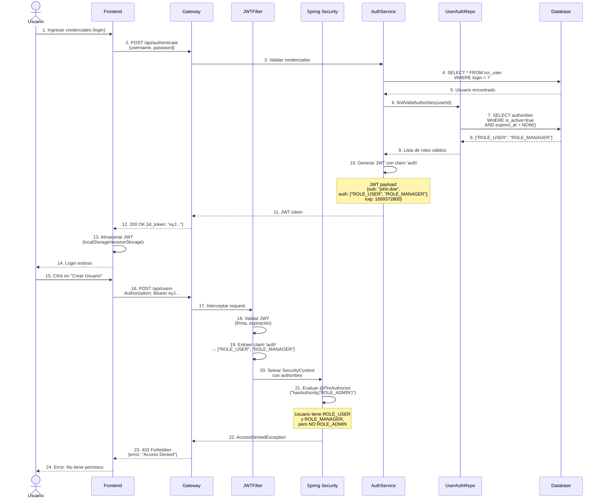
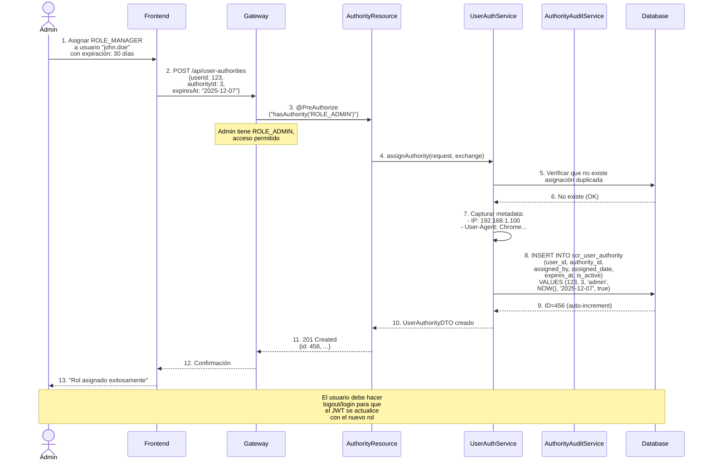
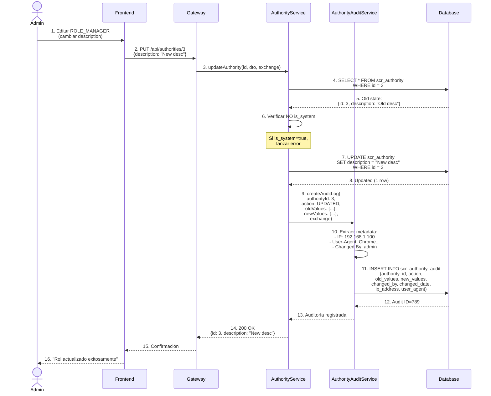
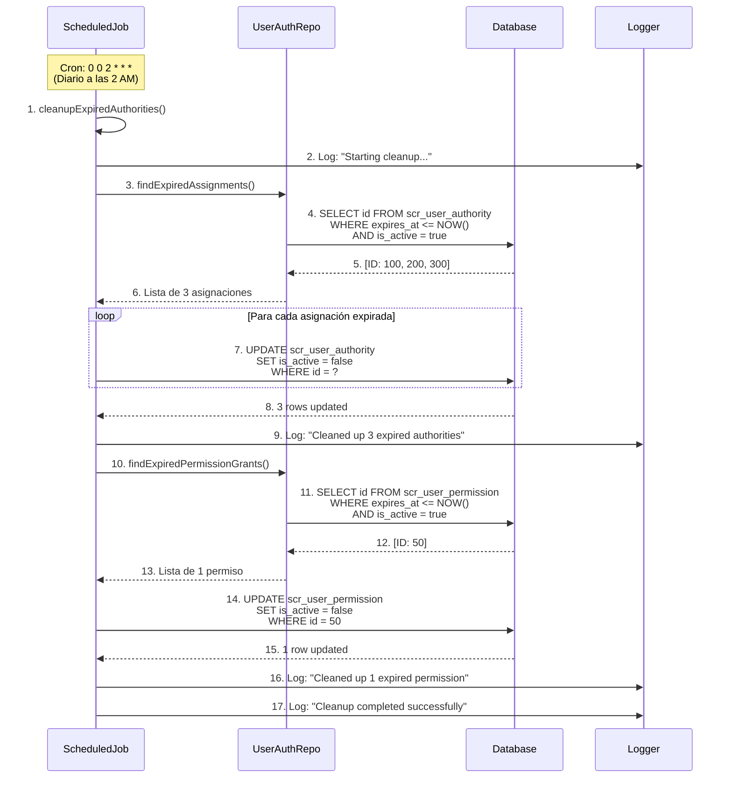
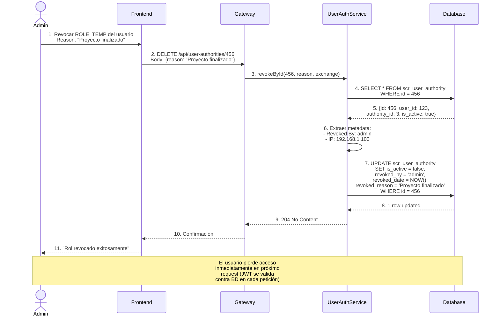
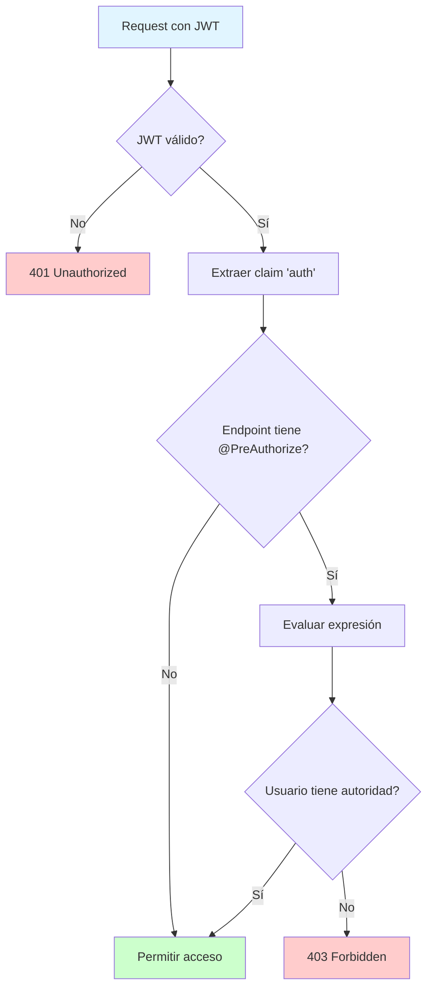
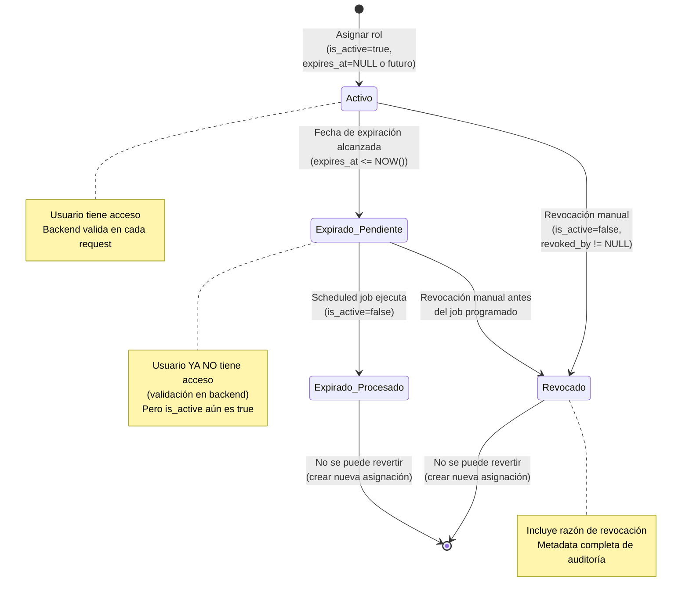
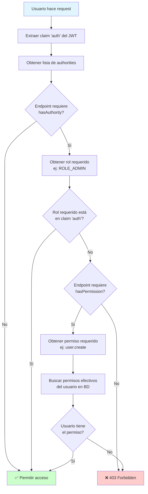
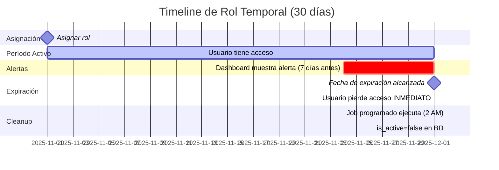

# Diagrama de Flujo de Autorización

**Versión:** 1.0
**Fecha:** 2025-11-07

---

## 1. Flujo Completo de Autenticación y Autorización



---

## 2. Flujo de Asignación de Rol



---

## 3. Flujo de Auditoría de Cambios



---

## 4. Flujo de Expiración Automática (Scheduled Job)



---

## 5. Flujo de Revocación Manual de Rol



---

## 6. Flujo de Validación de Permisos en Request



---

## 7. Estados de Asignación de Rol



---

## 8. Decisión de Autorización (Algoritmo)



**Permisos efectivos = Permisos de roles + Permisos directos**

```sql
-- Query para permisos efectivos
SELECT DISTINCT p.name FROM scr_permission p
LEFT JOIN scr_authority_permission ap ON p.id = ap.permission_id
LEFT JOIN scr_user_authority ua ON ap.authority_id = ua.authority_id
WHERE ua.user_id = ? AND ua.is_active = true
  AND (ua.expires_at IS NULL OR ua.expires_at > NOW())
UNION
SELECT p.name FROM scr_permission p
JOIN scr_user_permission up ON p.id = up.permission_id
WHERE up.user_id = ? AND up.is_active = true
  AND (up.expires_at IS NULL OR up.expires_at > NOW());
```

---

## 9. Timeline de Expiración de Rol



**Notas:**

- **2025-11-01**: Rol asignado con `expires_at = 2025-12-01`
- **2025-11-24**: Dashboard muestra alerta "Expira en 7 días"
- **2025-12-01 00:00**: Usuario pierde acceso (validación en backend)
- **2025-12-02 02:00**: Job marca `is_active=false` en BD

---

## 10. Comparación: Roles vs Permisos Directos

| Aspecto             | Via Roles                                   | Via Permisos Directos                        |
| ------------------- | ------------------------------------------- | -------------------------------------------- |
| **Asignación**      | Asignar rol al usuario                      | Grant permiso directo al usuario             |
| **Gestión**         | Centralizada (cambio en rol afecta a todos) | Individualizada (solo afecta al usuario)     |
| **Auditoría**       | Por rol y por usuario                       | Solo por usuario                             |
| **Uso recomendado** | Permisos permanentes y comunes              | Casos excepcionales temporales               |
| **Ejemplo**         | "Todos los managers pueden crear reportes"  | "Juan necesita exportar datos solo este mes" |
| **Ventaja**         | Escalable, fácil de gestionar               | Granular, flexible                           |
| **Desventaja**      | Menos flexible                              | Difícil de gestionar a escala                |

---

**Fin de los Diagramas de Flujo**
