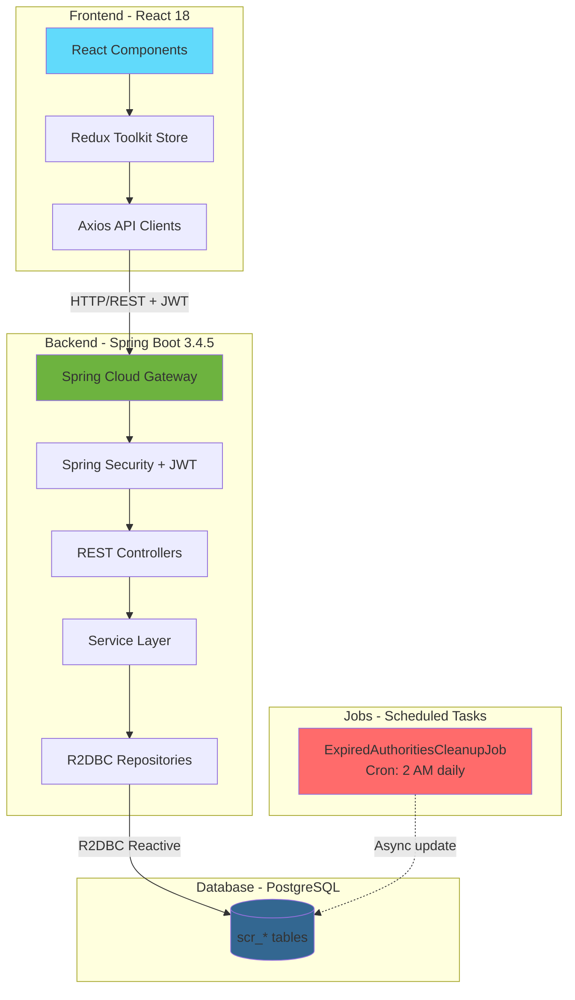
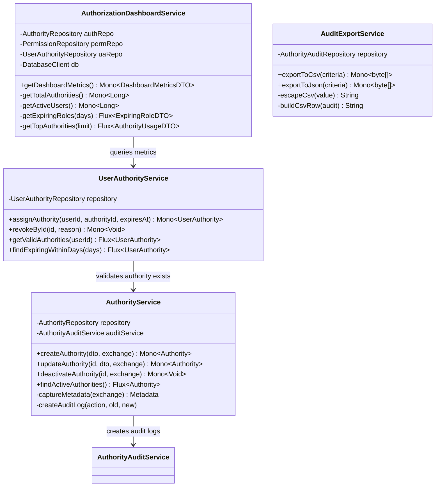
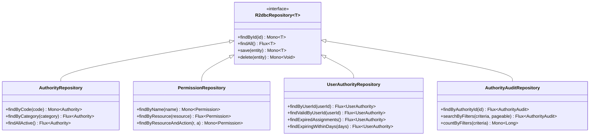
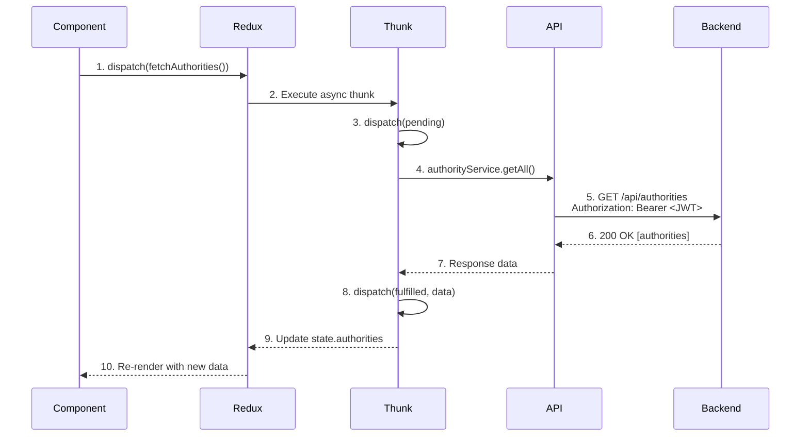
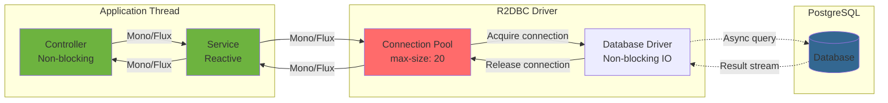
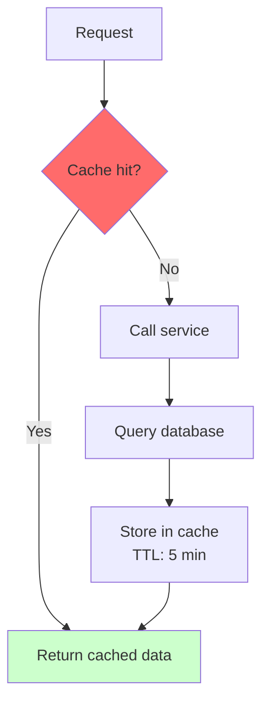
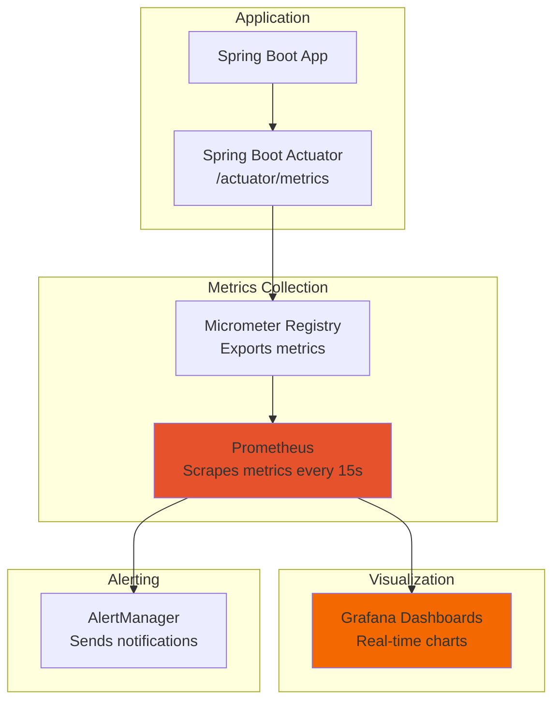
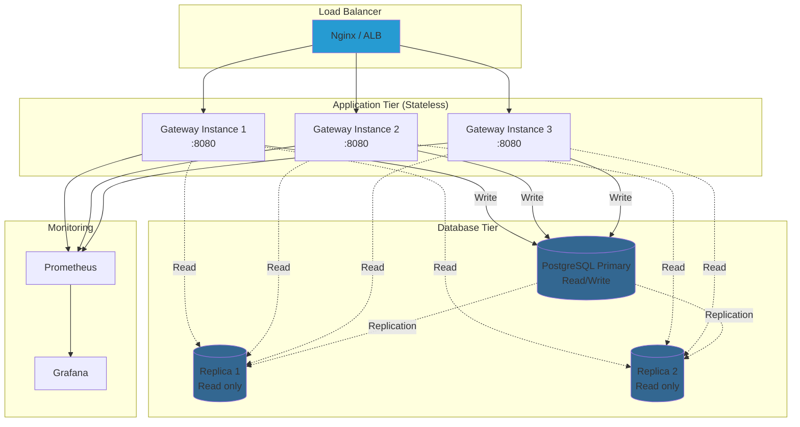

# Diagrama de Arquitectura de Componentes

**Versión:** 1.0
**Fecha:** 2025-11-07

---

## 1. Arquitectura General del Sistema



---

## 2. Arquitectura de Capas (Backend)

```mermaid
graph TD
    subgraph "Layer 1: Entry Point"
        GW[Spring Cloud Gateway<br/>Port 8080]
    end

    subgraph "Layer 2: Security"
        JWT[JWTFilter<br/>Validate token + extract roles]
        SEC[SecurityConfiguration<br/>@PreAuthorize evaluation]
    end

    subgraph "Layer 3: Controllers (REST API)"
        C1[AuthorityResource<br/>/api/authorities]
        C2[PermissionResource<br/>/api/permissions]
        C3[UserAuthorityResource<br/>/api/user-authorities]
        C4[AuthorizationDashboardResource<br/>/api/authorization/dashboard]
    end

    subgraph "Layer 4: Services (Business Logic)"
        S1[AuthorityService<br/>CRUD + Audit]
        S2[PermissionService<br/>CRUD]
        S3[UserAuthorityService<br/>Assign/Revoke]
        S4[AuthorityAuditService<br/>Query audit logs]
        S5[AuthorizationDashboardService<br/>Metrics aggregation]
        S6[AuditExportService<br/>CSV/JSON export]
    end

    subgraph "Layer 5: Repositories (Data Access)"
        R1[AuthorityRepository<br/>R2DBC]
        R2[PermissionRepository<br/>R2DBC]
        R3[UserAuthorityRepository<br/>R2DBC]
        R4[AuthorityAuditRepository<br/>R2DBC]
    end

    subgraph "Layer 6: Database"
        DB[(PostgreSQL<br/>scr_* tables)]
    end

    GW --> JWT
    JWT --> SEC
    SEC --> C1 & C2 & C3 & C4
    C1 --> S1
    C2 --> S2
    C3 --> S3
    C4 --> S5
    S1 --> R1 & R4
    S2 --> R2
    S3 --> R3
    S4 --> R4
    S5 --> R1 & R2 & R3 & R4
    S6 --> R4
    R1 & R2 & R3 & R4 --> DB

    style GW fill:#6db33f
    style JWT fill:#ff6b6b
    style DB fill:#336791
```

---

## 3. Componentes Backend Detallados

### 3.1 REST Controllers (6 componentes)

```mermaid
classDiagram
    class AuthorityResource {
        +getAllAuthorities() Flux~AuthorityDTO~
        +getAuthority(id) Mono~AuthorityDTO~
        +createAuthority(dto) Mono~AuthorityDTO~
        +updateAuthority(id, dto) Mono~AuthorityDTO~
        +deleteAuthority(id) Mono~Void~
    }

    class PermissionResource {
        +getAllPermissions() Flux~PermissionDTO~
        +getPermission(id) Mono~PermissionDTO~
        +createPermission(dto) Mono~PermissionDTO~
        +updatePermission(id, dto) Mono~PermissionDTO~
    }

    class UserAuthorityResource {
        +getUserAuthorities(userId) Flux~UserAuthorityDTO~
        +getValidAuthorities(userId) Flux~UserAuthorityDTO~
        +assignAuthority(request) Mono~UserAuthorityDTO~
        +revokeAuthority(id, request) Mono~Void~
        +getExpiringAuthorities(days) Flux~UserAuthorityDTO~
    }

    class AuthorityPermissionResource {
        +getPermissions(authorityId) Flux~PermissionDTO~
        +assignPermission(authorityId, permissionId) Mono~Void~
        +removePermission(authorityId, permissionId) Mono~Void~
    }

    class AuthorizationDashboardResource {
        +getDashboardMetrics() Mono~DashboardMetricsDTO~
    }

    class AuthorityAuditResource {
        +searchAudits(criteria, pageable) Mono~Page~
        +exportToCsv(criteria) Mono~byte[]~
        +exportToJson(criteria) Mono~byte[]~
    }
```



**Seguridad:**

- Todos los endpoints requieren `@PreAuthorize("hasAuthority('ROLE_ADMIN')")`
- JWT validation en `JWTFilter`

---

### 3.2 Service Layer (8 componentes)



**Patrón de Auditoría:**

```java
// En AuthorityService
public Mono<Authority> updateAuthority(Long id, AuthorityDTO dto, ServerWebExchange exchange) {
  return repository
    .findById(id)
    .flatMap(oldAuthority -> {
      // Capturar estado anterior
      String oldValues = toJson(oldAuthority);

      // Aplicar cambios
      updateEntity(oldAuthority, dto);

      // Guardar
      return repository
        .save(oldAuthority)
        .flatMap(newAuthority -> {
          // Capturar estado nuevo
          String newValues = toJson(newAuthority);

          // Crear log de auditoría
          return auditService
            .createAuditLog(newAuthority.getId(), AuditAction.UPDATED, oldValues, newValues, exchange)
            .thenReturn(newAuthority);
        });
    });
}

```

---

### 3.3 Repository Layer (6 componentes)



**Uso de DatabaseClient (queries custom):**

```java
@Repository
public class UserAuthorityRepositoryImpl {

  private final DatabaseClient databaseClient;

  public Flux<UserAuthority> findValidByUserId(Long userId) {
    String sql =
      """
      SELECT * FROM scr_user_authority
      WHERE user_id = :userId
        AND is_active = true
        AND (expires_at IS NULL OR expires_at > NOW())
      ORDER BY assigned_date DESC
      """;

    return databaseClient.sql(sql).bind("userId", userId).map(userAuthorityRowMapper).all();
  }
}

```

---

## 4. Componentes Frontend (React)

```mermaid
graph TD
    subgraph "Redux Store"
        A[authoritySlice<br/>21 async thunks]
        P[permissionSlice<br/>18 async thunks]
        UA[userAuthoritySlice<br/>15 async thunks]
    end

    subgraph "API Services"
        API1[authority.service.ts<br/>8 métodos HTTP]
        API2[permission.service.ts<br/>7 métodos HTTP]
        API3[user-authority.service.ts<br/>9 métodos HTTP]
        API4[dashboard.service.ts<br/>1 método HTTP]
    end

    subgraph "UI Components"
        subgraph "Authority Management"
            C1[authority-list.tsx]
            C2[authority-detail.tsx]
            C3[authority-form.tsx]
            C4[authority-delete-dialog.tsx]
        end

        subgraph "Permission Management"
            C5[permission-list.tsx]
            C6[permission-detail.tsx]
            C7[permission-form.tsx]
        end

        subgraph "User Authority Assignment"
            C8[user-authority-list.tsx]
            C9[assign-authority-dialog.tsx]
            C10[revoke-authority-dialog.tsx]
        end

        subgraph "Dashboard"
            C11[authorization-dashboard.tsx]
            C12[MetricCard.tsx]
            C13[RecentActivityWidget.tsx]
            C14[ExpiringRolesWidget.tsx]
            C15[TopAuthoritiesChart.tsx]
            C16[PermissionUsageChart.tsx]
        end
    end

    C1 & C2 & C3 & C4 --> A
    C5 & C6 & C7 --> P
    C8 & C9 & C10 --> UA
    C11 --> C12 & C13 & C14 & C15 & C16
    C11 --> API4
    A --> API1
    P --> API2
    UA --> API3

    style A fill:#764abc
    style P fill:#764abc
    style UA fill:#764abc
    style API1 fill:#61dafb
    style C11 fill:#ff6b6b
```



---

### 4.1 Redux State Management

**authority.reducer.ts:**

```typescript
interface AuthorityState {
  authorities: IAuthority[]; // Lista de todos los roles
  authority: IAuthority | null; // Rol seleccionado (detalle)
  loading: boolean; // Estado de carga
  error: string | null; // Mensajes de error
  updating: boolean; // Estado de actualización
  deleteSuccess: boolean; // Confirmación de eliminación
}

// 21 Async Thunks:
// - fetchAuthorities, fetchAuthority, createAuthority, updateAuthority
// - deleteAuthority, deactivateAuthority, activateAuthority
// - fetchAuthorityPermissions, assignPermissionToAuthority
// - removePermissionFromAuthority, etc.
```

**userAuthority.reducer.ts:**

```typescript
interface UserAuthorityState {
  userAuthorities: IUserAuthority[]; // Asignaciones del usuario
  validAuthorities: IUserAuthority[]; // Solo asignaciones válidas
  expiringAuthorities: IUserAuthority[]; // Próximas a expirar
  loading: boolean;
  error: string | null;
}

// 15 Async Thunks:
// - fetchUserAuthorities, fetchValidAuthorities, assignAuthority
// - revokeAuthority, fetchExpiringAuthorities, etc.
```

---

### 4.2 Flujo de Datos (Frontend → Backend)



---

## 5. Scheduled Jobs Architecture

```mermaid
graph LR
    subgraph "Spring Task Scheduler"
        TS[Task Scheduler<br/>Pool size: 2 threads]
    end

    subgraph "Cleanup Job"
        CJ[ExpiredAuthoritiesCleanupJob<br/>@Scheduled cron: 0 0 2 * * *]
        CJ1[cleanupExpiredAuthorities]
        CJ2[cleanupExpiredPermissions]
        CJ --> CJ1
        CJ --> CJ2
    end

    subgraph "Database Operations"
        Q1[Query expired authorities]
        U1[UPDATE is_active=false]
        Q2[Query expired permissions]
        U2[UPDATE is_active=false]
        CJ1 --> Q1 --> U1
        CJ2 --> Q2 --> U2
    end

    TS -.->|Executes daily 2 AM| CJ
    U1 --> DB[(scr_user_authority)]
    U2 --> DB2[(scr_user_permission)]

    style CJ fill:#ff6b6b
    style TS fill:#6db33f
```

**Configuración:**

```yaml
# application.yml
spring:
  task:
    scheduling:
      thread-name-prefix: tyse-scrutiny-gateway-scheduling-
      pool:
        size: 2 # 2 threads para scheduled tasks
```

**Anotación:**

```java
@Component
public class ExpiredAuthoritiesCleanupJob {

  @Scheduled(cron = "0 0 2 * * *") // 2 AM daily
  @Transactional
  public void cleanupExpiredAuthorities() {
    // Cleanup logic
  }
}

```

---

## 6. Flujo de Datos Reactivo (R2DBC)



**Ventajas del stack reactivo:**

- **Non-blocking I/O**: Un thread puede manejar miles de requests
- **Backpressure**: Control de flujo (no overflow de memoria)
- **Composition**: Fácil encadenar operaciones asíncronas
- **Resource efficiency**: Menos threads = menos overhead

**Ejemplo:**

```java
// Traditional (blocking)
public List<Authority> getAll() {
  return repository.findAll(); // Thread bloqueado hasta que BD responde
}

// Reactive (non-blocking)
public Flux<Authority> getAll() {
  return repository.findAll(); // Thread libre, BD procesa async
}

```

---

## 7. Integración con Spring Security

```mermaid
graph TD
    Request[HTTP Request<br/>+ JWT token] --> Gateway[Spring Cloud Gateway]
    Gateway --> Chain[SecurityWebFilterChain]

    subgraph "Security Filters"
        Chain --> F1[JWTFilter<br/>Extract + validate token]
        F1 --> F2[ReactiveAuthenticationManager<br/>Set SecurityContext]
        F2 --> F3[AuthorizationWebFilter<br/>@PreAuthorize evaluation]
    end

    F3 --> Decision{Authorized?}
    Decision -->|Yes| Controller[REST Controller<br/>Execute business logic]
    Decision -->|No| Deny[403 Forbidden]

    Controller --> Response[HTTP Response]
    Deny --> Response

    style Decision fill:#ff6b6b
    style Controller fill:#6db33f
    style Deny fill:#ffcccc
```

**Configuración de Security:**

```java
@Bean
public SecurityWebFilterChain springSecurityFilterChain(ServerHttpSecurity http) {
  return http
    .csrf()
    .disable()
    .authorizeExchange()
    .pathMatchers("/api/authorities/**")
    .hasAuthority("ROLE_ADMIN")
    .pathMatchers("/api/permissions/**")
    .hasAuthority("ROLE_ADMIN")
    .anyExchange()
    .authenticated()
    .and()
    .addFilterAt(jwtFilter(), SecurityWebFiltersOrder.AUTHENTICATION)
    .build();
}

```

---

## 8. Caching Strategy (Recomendación)



**Candidatos para caching:**

| Dato                   | TTL    | Invalidación                    |
| ---------------------- | ------ | ------------------------------- |
| Lista de roles activos | 5 min  | Al crear/modificar/eliminar rol |
| Permisos de un rol     | 10 min | Al asignar/remover permiso      |
| Dashboard metrics      | 1 min  | Manual (refresh button)         |

**Implementación con Caffeine:**

```java
@Configuration
public class CacheConfig {

  @Bean
  public Cache<String, List<Authority>> authorityCache() {
    return Caffeine.newBuilder().expireAfterWrite(5, TimeUnit.MINUTES).maximumSize(10_000).recordStats().build();
  }
}

```

---

## 9. Monitoreo y Observabilidad



**Métricas clave:**

- `http.server.requests` (latency, throughput)
- `r2dbc.pool.acquired` (connections in use)
- `authorization.expired.roles.total` (business metric)
- `jvm.memory.used` (heap usage)

---

## 10. Deployment Architecture



**Características:**

- **Horizontal scaling**: Agregar más instancias de Gateway
- **Stateless**: No hay sesiones en memoria (JWT en cada request)
- **Database replication**: Reads distribuidos, writes al primary
- **No sticky sessions**: Load balancer puede usar round-robin

---

**Fin de los Diagramas de Arquitectura**
