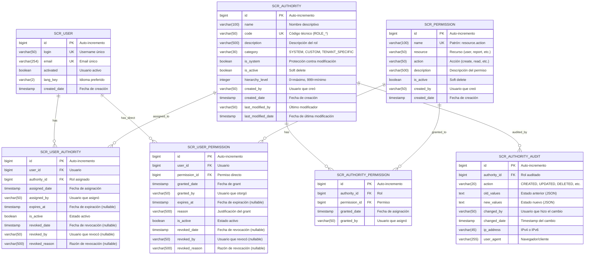

# Diagrama Entidad-Relación - Sistema de Autorización

**Versión:** 1.0
**Fecha:** 2025-11-07
**Tecnología:** PostgreSQL 14+ con R2DBC

---

## Diagrama ER Completo



---

## Descripción de Tablas

### 1. SCR_USER

**Propósito:** Usuarios del sistema (tabla existente de JHipster)

**Relaciones:**

- 1:N con `scr_user_authority` (un usuario puede tener múltiples roles)
- 1:N con `scr_user_permission` (un usuario puede tener múltiples permisos directos)

**Campos clave:**

- `activated`: Si es `false`, el usuario no puede hacer login
- `lang_key`: Idioma preferido (es, en)

---

### 2. SCR_AUTHORITY

**Propósito:** Roles del sistema

**Relaciones:**

- 1:N con `scr_user_authority` (un rol puede estar asignado a múltiples usuarios)
- 1:N con `scr_authority_permission` (un rol puede tener múltiples permisos)
- 1:N con `scr_authority_audit` (un rol tiene historial de cambios)

**Constraints:**

- `UNIQUE(code)`: No puede haber roles duplicados
- `CHECK(code LIKE 'ROLE_%')`: Convención de nombres

**Campos clave:**

- `is_system`: Si es `true`, el rol NO puede modificarse ni eliminarse (ROLE_ADMIN, ROLE_USER)
- `is_active`: Soft delete (permite desactivar sin eliminar)
- `hierarchy_level`: Orden de precedencia (0=máximo)

**Índices (5):**

```sql
CREATE INDEX idx_scr_authority_name ON scr_authority(name);
CREATE INDEX idx_scr_authority_code ON scr_authority(code);
CREATE INDEX idx_scr_authority_category ON scr_authority(category);
CREATE INDEX idx_scr_authority_is_active ON scr_authority(is_active);
CREATE INDEX idx_scr_authority_category_active ON scr_authority(category, is_active);
```

---

### 3. SCR_PERMISSION

**Propósito:** Permisos granulares

**Relaciones:**

- 1:N con `scr_authority_permission` (un permiso puede estar en múltiples roles)
- 1:N con `scr_user_permission` (un permiso puede estar asignado directamente a múltiples usuarios)

**Constraints:**

- `UNIQUE(name)`: No puede haber permisos duplicados
- `UNIQUE(resource, action)`: Combinación única

**Patrón de nombres:** `resource.action`

- Ejemplos: `user.create`, `report.export`, `authority.assign`

**Índices (5):**

```sql
CREATE INDEX idx_scr_permission_name ON scr_permission(name);
CREATE INDEX idx_scr_permission_resource ON scr_permission(resource);
CREATE INDEX idx_scr_permission_action ON scr_permission(action);
CREATE INDEX idx_scr_permission_is_active ON scr_permission(is_active);
CREATE INDEX idx_scr_permission_resource_active ON scr_permission(resource, is_active);
```

---

### 4. SCR_USER_AUTHORITY

**Propósito:** Asignaciones de roles a usuarios (junction table)

**Relaciones:**

- N:1 con `scr_user` (muchas asignaciones a un usuario)
- N:1 con `scr_authority` (muchas asignaciones de un rol)

**Constraints:**

- `UNIQUE(user_id, authority_id)`: Un usuario no puede tener el mismo rol duplicado
- `FK(user_id)` con `ON DELETE CASCADE`
- `FK(authority_id)` con `ON DELETE CASCADE`

**Campos clave:**

- `expires_at`: Si es NULL, el rol es permanente. Si no NULL, el rol expira automáticamente.
- `is_active`: Si es `false`, el rol está revocado o expirado (procesado por job)
- `revoked_reason`: Obligatorio al revocar manualmente

**Estados posibles:**

1. **Activo**: `is_active=true` y (`expires_at=NULL` o `expires_at > NOW()`)
2. **Expirado**: `is_active=true` pero `expires_at <= NOW()` (pendiente de cleanup)
3. **Expirado (procesado)**: `is_active=false` por job programado
4. **Revocado**: `is_active=false` con `revoked_by` != NULL

**Índices (7):**

```sql
CREATE INDEX idx_scr_user_authority_user_id ON scr_user_authority(user_id);  -- HOT PATH
CREATE INDEX idx_scr_user_authority_authority_id ON scr_user_authority(authority_id);
CREATE INDEX idx_scr_user_authority_is_active ON scr_user_authority(is_active);
CREATE INDEX idx_scr_user_authority_expires_at ON scr_user_authority(expires_at);  -- Para job
CREATE INDEX idx_scr_user_authority_expires_at_active ON scr_user_authority(expires_at, is_active);
CREATE INDEX idx_scr_user_authority_assigned_date ON scr_user_authority(assigned_date);
CREATE UNIQUE INDEX idx_scr_user_authority_user_authority_unique ON scr_user_authority(user_id, authority_id);
```

---

### 5. SCR_USER_PERMISSION

**Propósito:** Permisos directos a usuarios (bypass de roles)

**Relaciones:**

- N:1 con `scr_user`
- N:1 con `scr_permission`

**Uso:** Casos excepcionales donde un usuario necesita un permiso específico sin asignarle un rol completo.

**Constraints:**

- `UNIQUE(user_id, permission_id)`
- `FK` con `ON DELETE CASCADE`

**Campos clave:**

- `reason`: Justificación obligatoria del grant directo
- `expires_at`: Recomendado siempre poner fecha de expiración (prevenir "permisos zombie")

**Índices (6):**

```sql
CREATE INDEX idx_scr_user_permission_user_id ON scr_user_permission(user_id);
CREATE INDEX idx_scr_user_permission_permission_id ON scr_user_permission(permission_id);
CREATE INDEX idx_scr_user_permission_is_active ON scr_user_permission(is_active);
CREATE INDEX idx_scr_user_permission_expires_at ON scr_user_permission(expires_at);
CREATE INDEX idx_scr_user_permission_granted_date ON scr_user_permission(granted_date);
CREATE UNIQUE INDEX idx_scr_user_permission_user_permission_unique ON scr_user_permission(user_id, permission_id);
```

---

### 6. SCR_AUTHORITY_PERMISSION

**Propósito:** Relación N:N entre roles y permisos

**Relaciones:**

- N:1 con `scr_authority`
- N:1 con `scr_permission`

**Constraints:**

- `UNIQUE(authority_id, permission_id)`: Un rol no puede tener el mismo permiso duplicado
- `FK` con `ON DELETE CASCADE`

**Campos de auditoría:**

- `granted_by`: Usuario que asignó el permiso al rol
- `granted_date`: Timestamp de asignación

**Índices (2):**

```sql
CREATE INDEX idx_scr_authority_permission_authority_id ON scr_authority_permission(authority_id);
CREATE INDEX idx_scr_authority_permission_permission_id ON scr_authority_permission(permission_id);
```

---

### 7. SCR_AUTHORITY_AUDIT

**Propósito:** Log completo de cambios en roles

**Relaciones:**

- N:1 con `scr_authority`

**Constraints:**

- `FK(authority_id)` con `ON DELETE CASCADE`

**Campos clave:**

- `action`: Enum de tipo de cambio (CREATED, UPDATED, DELETED, PERMISSIONS_ADDED, etc.)
- `old_values`: Estado anterior serializado como JSON
- `new_values`: Estado nuevo serializado como JSON
- `ip_address`: IPv4 (15 chars) o IPv6 (45 chars)
- `user_agent`: Información del cliente (navegador, SO)

**Ejemplo de valores JSON:**

```json
// old_values
{
  "description": "Regular user",
  "hierarchyLevel": 500
}

// new_values
{
  "description": "Standard user with basic permissions",
  "hierarchyLevel": 400
}
```

**Índices (5):**

```sql
CREATE INDEX idx_scr_authority_audit_authority_id ON scr_authority_audit(authority_id);  -- HOT PATH
CREATE INDEX idx_scr_authority_audit_action ON scr_authority_audit(action);
CREATE INDEX idx_scr_authority_audit_changed_by ON scr_authority_audit(changed_by);
CREATE INDEX idx_scr_authority_audit_changed_date ON scr_authority_audit(changed_date);
CREATE INDEX idx_scr_authority_audit_authority_date ON scr_authority_audit(authority_id, changed_date DESC);
```

---

## Relaciones Clave

### Usuarios y Roles (N:N via scr_user_authority)

```sql
-- Obtener todos los roles activos de un usuario
SELECT a.* FROM scr_authority a
JOIN scr_user_authority ua ON a.id = ua.authority_id
WHERE ua.user_id = ? AND ua.is_active = true
  AND (ua.expires_at IS NULL OR ua.expires_at > NOW());
```

### Roles y Permisos (N:N via scr_authority_permission)

```sql
-- Obtener todos los permisos de un rol
SELECT p.* FROM scr_permission p
JOIN scr_authority_permission ap ON p.id = ap.permission_id
WHERE ap.authority_id = ? AND p.is_active = true;
```

### Usuarios y Permisos Directos (N:N via scr_user_permission)

```sql
-- Obtener permisos directos de un usuario
SELECT p.* FROM scr_permission p
JOIN scr_user_permission up ON p.id = up.permission_id
WHERE up.user_id = ? AND up.is_active = true
  AND (up.expires_at IS NULL OR up.expires_at > NOW());
```

### Permisos Efectivos de un Usuario (Roles + Directos)

```sql
-- Unión de permisos de roles y permisos directos
SELECT DISTINCT p.name FROM scr_permission p
-- Permisos via roles
LEFT JOIN scr_authority_permission ap ON p.id = ap.permission_id
LEFT JOIN scr_user_authority ua ON ap.authority_id = ua.authority_id
WHERE ua.user_id = ? AND ua.is_active = true
  AND (ua.expires_at IS NULL OR ua.expires_at > NOW())
  AND p.is_active = true
UNION
-- Permisos directos
SELECT p.name FROM scr_permission p
JOIN scr_user_permission up ON p.id = up.permission_id
WHERE up.user_id = ? AND up.is_active = true
  AND (up.expires_at IS NULL OR up.expires_at > NOW())
  AND p.is_active = true;
```

---

## Cardinalidades

| Relación                         | Cardinalidad | Descripción                                                       |
| -------------------------------- | ------------ | ----------------------------------------------------------------- |
| User → UserAuthority             | 1:N          | Un usuario puede tener múltiples roles                            |
| Authority → UserAuthority        | 1:N          | Un rol puede estar asignado a múltiples usuarios                  |
| Authority → AuthorityPermission  | 1:N          | Un rol puede tener múltiples permisos                             |
| Permission → AuthorityPermission | 1:N          | Un permiso puede estar en múltiples roles                         |
| User → UserPermission            | 1:N          | Un usuario puede tener múltiples permisos directos                |
| Permission → UserPermission      | 1:N          | Un permiso puede estar asignado directamente a múltiples usuarios |
| Authority → AuthorityAudit       | 1:N          | Un rol tiene historial de cambios                                 |

---

## Tamaños Estimados

| Tabla                    | Registros Típicos | Crecimiento | Retención                    |
| ------------------------ | ----------------- | ----------- | ---------------------------- |
| scr_authority            | 10-100            | Lento       | Permanente                   |
| scr_permission           | 50-500            | Lento       | Permanente                   |
| scr_authority_permission | 100-1,000         | Medio       | Permanente                   |
| scr_user_authority       | 100-10,000        | Alto        | Permanente (con soft delete) |
| scr_user_permission      | 10-1,000          | Bajo        | Permanente (con soft delete) |
| scr_authority_audit      | 1,000-100,000+    | Muy Alto    | 12 meses recomendado         |

---

## Datos Iniciales (Seed Data)

### scr_authority (2 registros)

```csv
id,name,code,category,is_system,is_active,hierarchy_level
1,Administrator,ROLE_ADMIN,SYSTEM,true,true,0
2,User,ROLE_USER,SYSTEM,true,true,500
```

### scr_permission (13 registros)

```csv
id,name,resource,action
1,user.create,user,create
2,user.read,user,read
3,user.update,user,update
4,user.delete,user,delete
5,authority.create,authority,create
6,authority.read,authority,read
7,authority.update,authority,update
8,authority.delete,authority,delete
9,authority.assign,authority,assign
10,permission.create,permission,create
11,permission.read,permission,read
12,permission.update,permission,update
13,permission.delete,permission,delete
```

### scr_authority_permission (13+ registros)

ROLE_ADMIN tiene los 13 permisos asignados.

---

**Fin del Diagrama ER**
