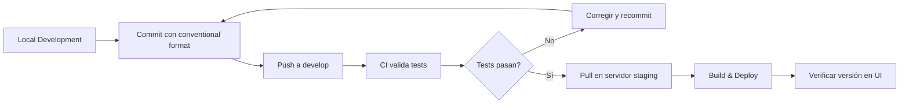

# Guía de Deployment a Staging

## 📋 Tabla de Contenidos

- [Introducción](#introducción)
- [Ambiente Staging](#ambiente-staging)
- [Pre-requisitos](#pre-requisitos)
- [Flujo Normal de Desarrollo](#flujo-normal-de-desarrollo)
- [Paso a Paso: Deployment a Staging](#paso-a-paso-deployment-a-staging)
- [Versionado en Staging](#versionado-en-staging)
- [Verificación Post-Deployment](#verificación-post-deployment)
- [Troubleshooting](#troubleshooting)
- [Diferencias con Producción](#diferencias-con-producción)

---

## Introducción

**Staging** es el ambiente de pre-producción donde se prueban features antes de ir a producción. Es un reflejo de producción pero permite experimentación y testing.

### Características de Staging

- **URL:** `192.168.0.58:8090`
- **Rama:** `develop`
- **Versionado:** Dinámico basado en git describe (ej: `v1.0.0-5-ga2f4b6c`)
- **Frecuencia:** Múltiples deployments por día
- **Tags:** NO se crean tags (solo en producción)

---

## Ambiente Staging

### Información del Servidor

```yaml
Host: 192.168.0.58
Puerto: 8090
Base de datos: PostgreSQL (localhost:5432)
Consul: localhost:8500
Kafka: localhost:9092
Ribbon: "Desarrollo" (marcador visual en el header)
```

### Propósito

1. **Testing de Features:** Probar nuevas funcionalidades antes de producción
2. **Integración:** Verificar integración con otros microservicios
3. **Demos:** Mostrar avances a stakeholders
4. **QA:** Ambiente para equipo de QA

---

## Pre-requisitos

### En tu Máquina Local

```bash
# 1. Java 17+
java --version
# openjdk version "17" o superior

# 2. Node.js 22.22.2+
node --version
# v22.22.2 o superior

# 3. Maven (via wrapper)
./mvnw --version

# 4. Git configurado
git config user.name
git config user.email

# 5. Acceso al repositorio
git remote -v
# origin  git@github.com:manuelmottaherrera/tyse-scrutiny-gateway.git
```

### En el Servidor Staging

```bash
# Verificar que servicios estén corriendo
docker ps | grep -E "consul|kafka|postgres"

# Consul health check
curl http://192.168.0.58:8500/v1/health/state/any

# PostgreSQL
psql -h localhost -U tyseScrutinyGateway -d tyseScrutinyGateway -c "SELECT 1;"
```

---

## Flujo Normal de Desarrollo

Este es el flujo día a día para staging:



### Commits Convencionales

**Importante:** Usa conventional commits para que el versionado automático funcione en producción.

```bash
# Features
git commit -m "feat(auth): agregar login con SSO"

# Bug fixes
git commit -m "fix(api): corregir timeout en divipol endpoint"

# Documentación
git commit -m "docs(deployment): actualizar guía de staging"

# Otros
git commit -m "chore(deps): actualizar Spring Boot a 3.4.5"
```

---

## Paso a Paso: Deployment a Staging

### Opción A: Deployment Simple (Push Directo)

**Cuándo usar:** Cambios pequeños, desarrollo normal.

#### Paso 1: Verificar Estado Local

```bash
# Ver rama actual
git branch
# * develop

# Ver cambios pendientes
git status

# Ver último commit
git log -1 --oneline
```

#### Paso 2: Ejecutar Tests Locales

```bash
# Backend tests
./mvnw verify

# Frontend tests
npm test

# E2E tests (opcional para staging)
npm run e2e:cypress:headless
```

**Nota:** El script `./scripts/push.sh` hace esto automáticamente.

#### Paso 3: Push a Develop con Validación CI

**IMPORTANTE:** Siempre usar el script `./scripts/push.sh` para mantener la calidad del código en develop.

**Opción Recomendada: Push con validación completa**

```bash
# Usa el script que ejecuta CI local antes de push
./scripts/push.sh

# Qué hace:
# 1. Limpia ambiente (kill procesos, limpiar puertos)
# 2. Ejecuta tests backend
# 3. Ejecuta tests frontend
# 4. Ejecuta E2E tests
# 5. Solo hace push si TODO pasa
```

**Alternativa: Push con validación parcial (sin E2E)**

```bash
# Si los tests E2E son muy lentos, puedes usar:
./scripts/push.sh --skip-e2e

# O ejecutar CI manualmente sin E2E:
./scripts/ci-local.sh

# Si pasa, entonces hacer push con:
./scripts/push.sh --skip-ci
```

**⚠️ NUNCA hacer `git push origin develop` directo**

- El script `push.sh` previene romper el build en develop
- Ahorra tiempo al equipo detectando errores antes del push
- Mantiene develop siempre en estado funcional

#### Paso 4: Deployment en Servidor Staging

**Conectar al servidor:**

```bash
ssh usuario@192.168.0.58
```

**En el servidor:**

```bash
# 1. Ir al directorio del proyecto
cd /path/to/tyse-scrutiny-gateway

# 2. Pull últimos cambios
git pull origin develop

# 3. Verificar que tienes los cambios
git log -1 --oneline

# 4. Detener aplicación actual (si está corriendo)
# Método 1: Si usa systemd
sudo systemctl stop tyse-scrutiny-gateway

# Método 2: Si usa script
./scripts/stop.sh

# Método 3: Manual
kill $(cat application.pid)

# 5. Build de producción
./mvnw -Pprod clean package -DskipTests

# 6. Iniciar aplicación
# Método 1: Systemd
sudo systemctl start tyse-scrutiny-gateway

# Método 2: Script
./scripts/start.sh

# Método 3: Manual
java -jar target/*.jar \
  --spring.profiles.active=prod,dev \
  > logs/application.log 2>&1 &

# 7. Guardar PID
echo $! > application.pid
```

#### Paso 5: Verificar Deployment

```bash
# En el servidor, esperar a que inicie (toma ~30-60 segundos)
tail -f logs/application.log

# Buscar línea de inicio exitoso:
# "Application 'TyseScrutinyGateway' is running!"

# Health check
curl http://localhost:8090/management/health
# {"status":"UP"}

# Verificar versión
curl http://localhost:8090/management/info
# {"build":{"version":"v1.0.0-5-ga2f4b6c"}}
```

#### Paso 6: Verificar en Browser

1. Abrir `http://192.168.0.58:8090`
2. **Verificar versión en header:** Debe mostrar algo como `v1.0.0-5-ga2f4b6c`
3. **Verificar ribbon:** Debe mostrar "Desarrollo"
4. **Hacer login** y probar funcionalidad

---

### Opción B: Deployment con Docker (Avanzado)

**Cuándo usar:** Ambiente más aislado, múltiples instancias.

#### Paso 1-3: Igual que Opción A

#### Paso 4: Build Docker Image

```bash
# En el servidor
cd /path/to/tyse-scrutiny-gateway

# Pull cambios
git pull origin develop

# Build imagen Docker
npm run java:docker
# o manualmente:
./mvnw -Pprod clean package -DskipTests
docker build -t tysescrutinygateway:latest .

# Verificar imagen
docker images | grep tysescrutinygateway
```

#### Paso 5: Deploy con Docker Compose

```bash
# Detener contenedor anterior
docker compose -f src/main/docker/app.yml down

# Iniciar nuevo contenedor
docker compose -f src/main/docker/app.yml up -d

# Ver logs
docker compose -f src/main/docker/app.yml logs -f
```

#### Paso 6: Verificar

```bash
# Health check
curl http://localhost:8090/management/health

# Ver logs de contenedor
docker logs $(docker ps -qf "name=tysescrutinygateway")
```

---

## Versionado en Staging

### Versión Dinámica Basada en Git

Staging **NO usa tags**, usa `git describe` para generar versión automática.

**Formato:** `v{último-tag}-{commits}-g{hash-corto}`

**Ejemplos:**

```bash
# Ejemplo 1: En el tag exacto
git tag v1.0.0
./mvnw -Pprod clean package
# Versión mostrada: v1.0.0

# Ejemplo 2: 5 commits después del tag
git commit -m "feat: feature 1"
git commit -m "fix: bug 1"
# ... (3 commits más)
./mvnw -Pprod clean package
# Versión mostrada: v1.0.0-5-ga2f4b6c

# Ejemplo 3: Sin tags en el repo
# (primera vez)
./mvnw -Pprod clean package
# Versión mostrada: c2862ac (solo hash)

# Ejemplo 4: Con cambios locales sin commit
./mvnw -Pprod clean package
# Versión mostrada: v1.0.0-5-ga2f4b6c-dirty
```

### Cómo se Configura

**En `pom.xml:1220`:**

```xml
<environmentVariables>
    <APP_VERSION>${git.commit.id.describe}</APP_VERSION>
</environmentVariables>
```

**Plugin git-commit-id-maven-plugin (pom.xml:838):**

```xml
<plugin>
    <groupId>io.github.git-commit-id</groupId>
    <artifactId>git-commit-id-maven-plugin</artifactId>
    <configuration>
        <includeOnlyProperties>
            <includeOnlyProperty>^git.commit.id.describe$</includeOnlyProperty>
        </includeOnlyProperties>
    </configuration>
</plugin>
```

### Ventajas de la Versión Dinámica

1. **Trazabilidad exacta:** Sabes exactamente qué commit está en staging
2. **Sin mantenimiento:** No necesitas crear/borrar tags de staging
3. **Reproducible:** Puedes hacer `git checkout a2f4b6c` para reproducir el ambiente
4. **Visual:** Ves de un vistazo cuántos commits hay desde el último release

---

## Verificación Post-Deployment

### Checklist de Verificación

- [ ] **Aplicación inicia correctamente**

  ```bash
  curl http://192.168.0.58:8090/management/health
  # {"status":"UP"}
  ```

- [ ] **Versión correcta en header UI**

  - Abrir `http://192.168.0.58:8090`
  - Ver header: `TyseScrutinyGateway - v1.0.0-5-ga2f4b6c`

- [ ] **Ribbon de desarrollo visible**

  - Debe mostrar "Desarrollo" en rojo/amarillo

- [ ] **Base de datos accesible**

  ```bash
  curl http://192.168.0.58:8090/api/account
  # Debe retornar datos de usuario o 401
  ```

- [ ] **Consul registrado**

  - Abrir `http://192.168.0.58:8500/ui/`
  - Verificar que `tysescrutinygateway` aparece en Services

- [ ] **Kafka conectado**

  ```bash
  # Ver logs
  grep -i kafka logs/application.log
  # No debe haber errores de conexión
  ```

- [ ] **Funcionalidad básica**
  - Login funciona
  - API endpoints responden
  - Permisos enterprise funcionan

### Logs a Revisar

```bash
# 1. Errores durante inicio
grep -i "error\|exception" logs/application.log | tail -50

# 2. Verificar que Liquibase corrió OK
grep -i "liquibase" logs/application.log

# 3. Verificar conexión a Consul
grep -i "consul" logs/application.log

# 4. Verificar conexión a Kafka
grep -i "kafka" logs/application.log

# 5. Verificar que el contexto cargó correctamente
grep "Started TyseScrutinyGatewayApp" logs/application.log
```

---

## Troubleshooting

### Problema 1: "Port 8090 already in use"

**Causa:** La aplicación anterior no se detuvo correctamente.

**Solución:**

```bash
# Encontrar proceso usando puerto 8090
lsof -i :8090
# O
netstat -tulpn | grep 8090

# Matar proceso
kill -9 [PID]

# O si tienes el PID file
kill $(cat application.pid)

# Intentar deployment de nuevo
```

---

### Problema 2: "Could not connect to Consul"

**Causa:** Consul no está corriendo.

**Solución:**

```bash
# Verificar si Consul está corriendo
docker ps | grep consul

# Si no está corriendo, iniciarlo
cd /path/to/tyse-scrutiny-gateway
docker compose -f src/main/docker/consul.yml up -d

# Verificar que inició
curl http://localhost:8500/v1/status/leader
```

---

### Problema 3: "Liquibase lock"

**Síntoma:**

```
Waiting for changelog lock....
Waiting for changelog lock....
```

**Causa:** Un deployment anterior falló y dejó el lock de Liquibase.

**Solución:**

```bash
# Conectar a PostgreSQL
psql -h localhost -U tyseScrutinyGateway -d tyseScrutinyGateway

# Liberar lock
UPDATE databasechangeloglock SET locked = FALSE WHERE id = 1;

# Salir
\q

# Reintentar deployment
```

---

### Problema 4: Versión mostrada es incorrecta

**Síntoma:** La versión en el header no cambia después de deployment.

**Causa:** Build incorrecto o cache del navegador.

**Solución:**

```bash
# 1. Verificar que el build fue con perfil prod
./mvnw -Pprod clean package -DskipTests

# 2. Verificar archivo git.properties
cat target/classes/git.properties
# Debe contener:
# git.commit.id.describe=v1.0.0-5-ga2f4b6c

# 3. Verificar bundle JavaScript
strings target/classes/static/main.*.js | grep v1.0.0

# 4. En el navegador, hard refresh
# Ctrl+Shift+R (Linux/Windows)
# Cmd+Shift+R (Mac)
```

---

### Problema 5: Tests fallan en CI

**Síntoma:** `./scripts/push.sh` falla en tests.

**Solución:**

```bash
# Ver qué test falló específicamente
./scripts/ci-local.sh --with-e2e

# Correr test específico
./mvnw test -Dtest=NombreDelTest

# Ver logs detallados
cat target/surefire-reports/*.txt

# Corregir test y volver a intentar
```

---

## Diferencias con Producción

| Aspecto             | Staging                | Producción                |
| ------------------- | ---------------------- | ------------------------- |
| **Ambiente**        | `192.168.0.58:8090`    | TBD                       |
| **Rama**            | `develop`              | `main`                    |
| **Versionado**      | Git describe dinámico  | Tags semánticos           |
| **Ejemplo versión** | `v1.0.0-5-ga2f4b6c`    | `v1.1.0`                  |
| **Tags**            | No se crean            | Se crean con cada release |
| **Frequency**       | Múltiple por día       | 1-2 por semana            |
| **Tests**           | Opcionales (rápido)    | Obligatorios (completos)  |
| **Ribbon**          | "Desarrollo" (visible) | Sin ribbon                |
| **Rollback**        | Git revert simple      | Requiere planificación    |
| **Downtime**        | Permitido              | Minimizar                 |

---

## Automatización Futura (Roadmap)

### CI/CD con GitHub Actions

```yaml
# .github/workflows/deploy-staging.yml
name: Deploy to Staging

on:
  push:
    branches: [develop]

jobs:
  deploy:
    runs-on: ubuntu-latest
    steps:
      - uses: actions/checkout@v3
      - name: Set up JDK 17
        uses: actions/setup-java@v3
        with:
          java-version: '17'
      - name: Run tests
        run: ./mvnw verify
      - name: Build
        run: ./mvnw -Pprod package -DskipTests
      - name: Deploy to staging
        run: |
          scp target/*.jar staging-server:/app/
          ssh staging-server 'systemctl restart tyse-gateway'
```

### Webhooks de Deployment

Configurar webhook en GitHub para notificar deployments:

- Slack notification
- Email a equipo
- Dashboard de deployments

---

## Ver También

- [Deployment a Producción](./deployment-produccion.md) - Proceso formal con releases
- [Versionado Automático](./versionado-automatico.md) - Cómo funciona standard-version
- [CI/CD](./ci-cd/) - Scripts y configuración de integración continua

---

## Comandos Rápidos de Referencia

```bash
# Push con validación completa (recomendado)
./scripts/push.sh

# Push sin E2E (más rápido)
./scripts/push.sh --skip-e2e

# Build local para probar
./mvnw -Pprod clean package -DskipTests

# Ver versión que se generaría
git describe --tags --always --dirty

# Conectar a staging
ssh usuario@192.168.0.58

# Ver logs en staging
tail -f /path/to/logs/application.log

# Health check
curl http://192.168.0.58:8090/management/health
```
