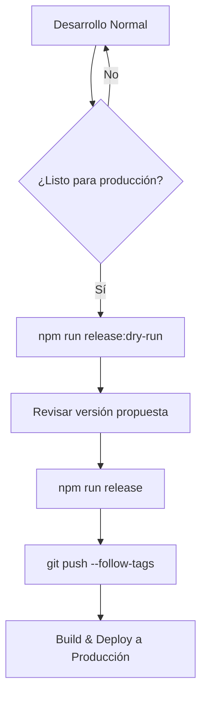

# Versionado Automático con Standard-Version

## 📋 Tabla de Contenidos

- [Introducción](#introducción)
- [¿Qué es Standard-Version?](#qué-es-standard-version)
- [Configuración](#configuración)
- [Comandos Disponibles](#comandos-disponibles)
- [Workflow de Versionado](#workflow-de-versionado)
- [Conventional Commits](#conventional-commits)
- [Cómo Decide la Versión](#cómo-decide-la-versión)
- [Ejemplos Prácticos](#ejemplos-prácticos)
- [Troubleshooting](#troubleshooting)

---

## Introducción

Este proyecto usa **standard-version** para automatizar el versionado siguiendo [Semantic Versioning](https://semver.org/) (SemVer).

### ¿Por qué versionado automático?

**Antes:**

- ❌ "¿Qué versión le pongo?"
- ❌ Versiones inconsistentes entre package.json y pom.xml
- ❌ CHANGELOG manual (o inexistente)
- ❌ Olvidar crear tags de git

**Ahora:**

- ✅ Versión determinada automáticamente según commits
- ✅ package.json y pom.xml sincronizados automáticamente
- ✅ CHANGELOG generado automáticamente
- ✅ Tags de git creados automáticamente

---

## ¿Qué es Standard-Version?

**Standard-Version** es una herramienta que:

1. **Analiza tus commits** desde el último tag (usando Conventional Commits)
2. **Determina el tipo de versión** (MAJOR, MINOR, PATCH)
3. **Actualiza archivos** (package.json, pom.xml)
4. **Genera CHANGELOG.md** con los cambios
5. **Crea commit y tag** de release automáticamente

---

## Configuración

### Archivos de Configuración

#### `.versionrc.json`

Configuración principal de standard-version:

```json
{
  "types": [
    { "type": "feat", "section": "Features" },
    { "type": "fix", "section": "Bug Fixes" },
    { "type": "perf", "section": "Performance Improvements" },
    { "type": "docs", "section": "Documentation" }
  ],
  "bumpFiles": [
    { "filename": "package.json", "type": "json" },
    { "filename": "pom.xml", "updater": "pom-updater.js" }
  ],
  "tagPrefix": "v"
}
```

**Qué hace:**

- Define qué tipos de commit aparecen en el CHANGELOG
- Indica qué archivos actualizar con la nueva versión
- Usa `pom-updater.js` personalizado para Maven

#### `pom-updater.js`

Script personalizado que permite a standard-version actualizar `pom.xml`:

```javascript
module.exports.readVersion = function (contents) {
  // Lee la versión actual del pom.xml
};

module.exports.writeVersion = function (contents, version) {
  // Escribe la nueva versión en el pom.xml
};
```

### Dependencias Instaladas

```json
{
  "devDependencies": {
    "standard-version": "^9.x.x",
    "xml2js": "^0.6.2"
  }
}
```

---

## Comandos Disponibles

### Comando Principal

```bash
npm run release
```

**Qué hace:**

1. Analiza commits desde el último tag
2. Determina versión automáticamente según semántica
3. Actualiza `package.json` y `pom.xml`
4. Genera/actualiza `CHANGELOG.md`
5. Crea commit: `chore(release): vX.Y.Z`
6. Crea tag: `vX.Y.Z`

**Salida típica:**

```
✔ bumping version in package.json from 1.0.0 to 1.1.0
✔ bumping version in pom.xml from 1.0.0 to 1.1.0
✔ outputting changes to CHANGELOG.md
✔ committing package.json pom.xml CHANGELOG.md
✔ tagging release v1.1.0
ℹ Run `git push --follow-tags origin develop` to publish
```

---

### Comandos Específicos

#### Forzar tipo de versión

```bash
# Forzar PATCH (1.0.0 → 1.0.1)
npm run release:patch

# Forzar MINOR (1.0.0 → 1.1.0)
npm run release:minor

# Forzar MAJOR (1.0.0 → 2.0.0)
npm run release:major
```

**Cuándo usar:**

- `release:patch` - Hotfix urgente en producción
- `release:minor` - Cuando quieres forzar minor aunque solo haya fixes
- `release:major` - Release mayor planeado

#### Modo dry-run (simulación)

```bash
# Ver qué haría sin aplicar cambios
npm run release:dry-run
```

**Salida:**

```
✔ bumping version in package.json from 1.0.0 to 1.1.0
✔ bumping version in pom.xml from 1.0.0 to 1.1.0
✔ created CHANGELOG.md
```

**Útil para:**

- Verificar qué versión se generaría antes de ejecutar
- Entender cómo standard-version interpreta tus commits
- Revisar cambios del CHANGELOG antes de publicar

---

## Workflow de Versionado

### Flujo Completo



### Paso a Paso

**1. Desarrollo Normal (Staging)**

```bash
# Trabajas con conventional commits
git commit -m "feat(auth): agregar 2FA"
git commit -m "fix(api): corregir timeout"

# Push a develop (staging) con validación CI
./scripts/push.sh

# Staging muestra: v1.0.0-2-ga3f4b2c
# (versión dinámica basada en git describe)
```

**2. Preparar Release para Producción**

⚠️ **IMPORTANTE:** Los releases siempre se hacen desde la rama `main`, nunca desde `develop`. Primero debes hacer merge de develop a main.

```bash
# Primero, cambiar a main y hacer merge desde develop
git checkout main
git merge develop --no-ff

# Verificar qué versión se generaría
npm run release:dry-run

# Output esperado:
# bumping version from 1.0.0 to 1.1.0
```

**3. Ejecutar Release**

```bash
npm run release
```

**Qué sucede internamente:**

```
1. Lee commits desde v1.0.0
   ├─ feat(auth): agregar 2FA       → Causa MINOR bump
   └─ fix(api): corregir timeout    → No afecta (feat ya causó MINOR)

2. Determina nueva versión: 1.1.0

3. Actualiza archivos:
   ├─ package.json: "version": "1.1.0"
   ├─ pom.xml: <version>1.1.0</version>
   └─ CHANGELOG.md: Agrega sección ### [1.1.0]

4. Crea commit:
   └─ "chore(release): v1.1.0"

5. Crea tag:
   └─ v1.1.0
```

**4. Publicar**

```bash
# Push con tags (a main para producción)
git push --follow-tags origin main

# Nota: --follow-tags solo pushea tags anotados de commits pusheados
# No pushea TODOS los tags (más seguro que --tags)
```

**5. Deploy**

```bash
# Build de producción
./mvnw -Pprod clean package

# Deploy a servidor de producción
# La aplicación ahora mostrará: v1.1.0
```

---

## Conventional Commits

Standard-version usa **Conventional Commits** para determinar versiones.

### Formato

```
<tipo>(<scope>): <descripción>

[cuerpo opcional]

[footer opcional]
```

### Tipos Importantes

| Tipo               | Versión | Aparece en CHANGELOG | Ejemplo                                     |
| ------------------ | ------- | -------------------- | ------------------------------------------- |
| `feat:`            | MINOR   | ✅ Sí                | `feat(auth): agregar login con Google`      |
| `fix:`             | PATCH   | ✅ Sí                | `fix(api): corregir memoria leak`           |
| `perf:`            | PATCH   | ✅ Sí                | `perf(db): optimizar query de usuarios`     |
| `docs:`            | -       | ✅ Sí                | `docs(readme): actualizar guía instalación` |
| `BREAKING CHANGE:` | MAJOR   | ✅ Sí                | Ver ejemplo abajo                           |
| `style:`           | -       | ❌ No                | `style(header): ajustar espaciado`          |
| `refactor:`        | -       | ❌ No                | `refactor(auth): limpiar código legacy`     |
| `test:`            | -       | ❌ No                | `test(api): agregar tests de integración`   |
| `chore:`           | -       | ❌ No                | `chore(deps): actualizar dependencies`      |

### Ejemplos de Commits

#### Feature (MINOR)

```bash
git commit -m "feat(divipol): agregar búsqueda por coordenadas GPS

Permite buscar departamentos/municipios por latitud y longitud.
Útil para integración con mapas."
```

#### Bug Fix (PATCH)

```bash
git commit -m "fix(auth): corregir validación de email

El regex no permitía emails con subdominios como user@mail.co.uk"
```

#### Breaking Change (MAJOR)

```bash
git commit -m "feat(api): cambiar estructura de respuesta de endpoints

BREAKING CHANGE: Todos los endpoints ahora retornan {data, meta}
en lugar de array directo. Clientes deben actualizar código para
acceder response.data en lugar de response directamente."
```

#### Documentation (sin bump de versión)

```bash
git commit -m "docs(deployment): agregar guía de deployment a staging"
```

### Scopes Comunes

| Scope        | Descripción                 | Ejemplo                                      |
| ------------ | --------------------------- | -------------------------------------------- |
| `auth`       | Autenticación/autorización  | `feat(auth): agregar 2FA`                    |
| `api`        | Endpoints REST              | `fix(api): corregir timeout`                 |
| `divipol`    | Módulo de división política | `feat(divipol): agregar filtro por región`   |
| `ui`         | Interfaz de usuario         | `fix(ui): corregir responsive mobile`        |
| `db`         | Base de datos               | `perf(db): optimizar índices`                |
| `deployment` | Deployment/CI/CD            | `fix(deployment): corregir versión dinámica` |
| `deps`       | Dependencias                | `chore(deps): actualizar Spring Boot`        |

---

## Cómo Decide la Versión

### Reglas de Decisión

```
Commits desde último tag:
├─ ¿Hay BREAKING CHANGE? → MAJOR (1.0.0 → 2.0.0)
├─ ¿Hay feat:? → MINOR (1.0.0 → 1.1.0)
├─ ¿Solo fix:? → PATCH (1.0.0 → 1.0.1)
└─ ¿No hay cambios relevantes? → SIN RELEASE
```

### Ejemplos de Decisión

#### Ejemplo 1: Solo fixes

```bash
# Commits desde v1.0.0
git commit -m "fix(auth): corregir sesión expirada"
git commit -m "fix(api): resolver CORS issue"

# Resultado
npm run release
# → v1.0.0 to v1.0.1 (PATCH)
```

#### Ejemplo 2: Feature + fixes

```bash
# Commits desde v1.0.0
git commit -m "feat(divipol): búsqueda por coordenadas"
git commit -m "fix(auth): corregir validación"
git commit -m "fix(ui): ajustar responsive"

# Resultado
npm run release
# → v1.0.0 to v1.1.0 (MINOR)
# Nota: La presencia de feat: determina MINOR
```

#### Ejemplo 3: Breaking change

```bash
# Commits desde v1.0.0
git commit -m "feat(api): nueva estructura de respuesta

BREAKING CHANGE: Los endpoints ahora retornan {data, meta}"

# Resultado
npm run release
# → v1.0.0 to v2.0.0 (MAJOR)
```

#### Ejemplo 4: Solo docs/chore

```bash
# Commits desde v1.0.0
git commit -m "docs(readme): actualizar guía"
git commit -m "chore(deps): actualizar typescript"

# Resultado
npm run release
# → No genera release (ningún cambio relevante)
```

---

## Ejemplos Prácticos

### Escenario 1: Hotfix Urgente en Producción

**Situación:** Bug crítico en producción v1.2.0

```bash
# 1. Crear rama de hotfix desde producción
git checkout -b hotfix/critical-auth-bug v1.2.0

# 2. Corregir el bug
git commit -m "fix(auth): corregir vulnerability de sesión

CVE-2025-XXXX: Sesiones no expiraban correctamente"

# 3. Forzar PATCH release
npm run release:patch
# → v1.2.0 to v1.2.1

# 4. Merge a main y deploy urgente
git checkout main
git merge hotfix/critical-auth-bug --no-ff
git push --follow-tags origin main

# 5. Deploy a producción
./mvnw -Pprod clean package
# Deploy urgente
```

---

### Escenario 2: Release Normal con Features

**Situación:** Sprint completado con nuevas features

```bash
# 1. Verificar commits acumulados
git log v1.2.0..HEAD --oneline
# feat(divipol): búsqueda avanzada
# feat(auth): agregar SSO
# fix(ui): corregir layout mobile
# docs(api): actualizar swagger

# 2. Simular release
npm run release:dry-run
# → bumping version from 1.2.0 to 1.3.0

# 3. Ejecutar release
npm run release

# 4. Revisar CHANGELOG generado
cat CHANGELOG.md | head -30

# 5. Push y deploy (a main para producción)
git push --follow-tags origin main
./mvnw -Pprod clean package
```

---

### Escenario 3: Major Release con Breaking Changes

**Situación:** Cambio de API que rompe compatibilidad

```bash
# 1. Commits con breaking change
git commit -m "feat(api): migrar a REST v2

BREAKING CHANGE:
- Endpoints movidos de /api/v1 a /api/v2
- Estructura de respuesta cambiada a {data, meta, errors}
- Autenticación ahora requiere header X-API-Version: 2"

# 2. Ejecutar release (auto-detecta MAJOR)
npm run release
# → v1.5.0 to v2.0.0

# 3. Revisar CHANGELOG
# Debería incluir sección "BREAKING CHANGES"

# 4. Comunicar a clientes antes de deploy
# Enviar email con guía de migración

# 5. Deploy a producción
git push --follow-tags origin main
./mvnw -Pprod clean package
```

---

## Troubleshooting

### Problema 1: "No commits found"

**Síntoma:**

```
npm run release
✖ No commits found that affect the version
```

**Causa:** No hay commits con `feat:`, `fix:`, etc. desde el último tag.

**Solución:**

```bash
# Opción A: Forzar patch release
npm run release:patch

# Opción B: Agregar commit relevante
git commit -m "chore: bump version" --allow-empty
npm run release
```

---

### Problema 2: Versión incorrecta en pom.xml

**Síntoma:** standard-version no actualiza `pom.xml` correctamente.

**Causa:** Error en `pom-updater.js` o estructura de pom.xml no estándar.

**Solución:**

```bash
# 1. Verificar que pom-updater.js existe
ls -la pom-updater.js

# 2. Verificar que xml2js está instalado
npm list xml2js

# 3. Probar manualmente el updater
node -e "const u = require('./pom-updater'); console.log(u.readVersion(require('fs').readFileSync('pom.xml', 'utf8')))"

# 4. Si falla, actualizar manualmente
npm run release
# Luego editar pom.xml manualmente y amend el commit
```

---

### Problema 3: CHANGELOG no se genera

**Síntoma:** `CHANGELOG.md` no se crea o no se actualiza.

**Causa:** Configuración incorrecta o no hay commits relevantes.

**Solución:**

```bash
# 1. Verificar .versionrc.json
cat .versionrc.json

# 2. Verificar que skip.changelog es false
# "skip": { "changelog": false }

# 3. Forzar recreación
rm CHANGELOG.md
npm run release
```

---

### Problema 4: Tag ya existe

**Síntoma:**

```
fatal: tag 'v1.3.0' already exists
```

**Causa:** El tag ya fue creado localmente o remotamente.

**Solución:**

```bash
# Opción A: Borrar tag local y rehacer
git tag -d v1.3.0
npm run release

# Opción B: Forzar siguiente versión
npm run release:minor  # Salta a v1.4.0
```

---

### Problema 5: Quiero revertir un release

**Situación:** Ejecutaste `npm run release` pero quieres deshacerlo.

**Solución:**

```bash
# 1. Identificar el commit de release
git log -1
# commit abc123: chore(release): v1.3.0

# 2. Identificar versión anterior
git log -2 --oneline
# abc123 chore(release): v1.3.0
# def456 feat(auth): ultima feature

# 3. Revertir commit de release
git reset --hard def456

# 4. Borrar tag
git tag -d v1.3.0

# 5. Restaurar versión en archivos
git checkout HEAD~1 -- package.json pom.xml

# 6. Opcional: Borrar CHANGELOG.md si se creó
git checkout HEAD~1 -- CHANGELOG.md
```

---

## Recursos Adicionales

- **Conventional Commits:** https://www.conventionalcommits.org/
- **Standard-Version GitHub:** https://github.com/conventional-changelog/standard-version
- **Semantic Versioning:** https://semver.org/
- **Commitlint:** https://commitlint.js.org/ (validador de commits)

---

## Ver También

- [Deployment a Staging](./deployment-staging.md) - Flujo de staging con versionado dinámico
- [Deployment a Producción](./deployment-produccion.md) - Flujo de producción con releases
- [CI/CD](./ci-cd/) - Integración con pipelines
